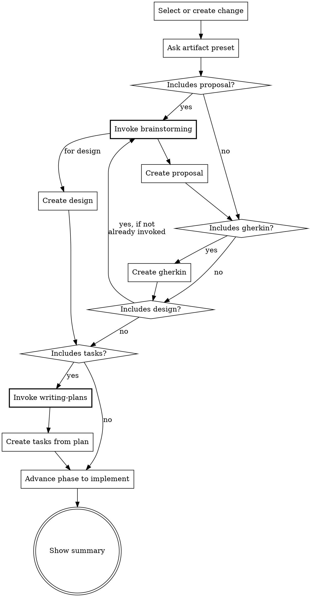
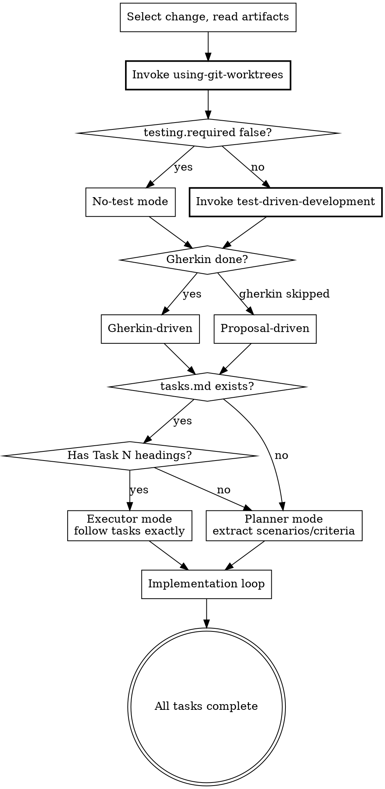

# Skill Precision Optimization Implementation Plan

> **For agentic workers:** REQUIRED: Use superpowers:subagent-driven-development (if subagents available) or superpowers:executing-plans to implement this plan. Steps use checkbox (`- [ ]`) syntax for tracking.

**Goal:** Improve Beat skill execution precision by adding anti-rationalization mechanisms, optimizing descriptions, adding decision flowcharts, extracting subagent prompts, and enforcing annotation conventions.

**Architecture:** Pure documentation changes — editing SKILL.md files and creating new .md reference/prompt files. No executable code. Each task modifies one or a small group of related files, committed independently.

**Tech Stack:** Markdown (SKILL.md with YAML frontmatter), DOT flowcharts

**Implementation note:** Line numbers in this plan refer to the **original** file before any modifications. When editing, use the quoted text anchors (not line numbers) to locate insertion/replacement points, since prior steps shift line positions.

**Spec:** `docs/superpowers/specs/2026-03-17-skill-precision-optimization-design.md`

---

## File Structure

Files created or modified in this plan:

**New files:**
- `references/testing-conventions.md` — annotation format and e2e test style reference (Task 1)
- `skills/verify/verification-subagent-prompt.md` — standalone verification subagent prompt (Task 6)
- `skills/distill/distill-subagent-prompt.md` — standalone distill verification subagent prompt (Task 7)

**Modified files (description only — Change 2):**
- `skills/new/SKILL.md` — description update (Task 2)
- `skills/explore/SKILL.md` — description update (Task 2)
- `skills/sync/SKILL.md` — description update (Task 2)
- `skills/archive/SKILL.md` — description update (Task 2)
- `skills/setup/SKILL.md` — description update (Task 2)

**Modified files (structural changes — Changes 1, 3, 5, 6):**
- `skills/ff/SKILL.md` — description + hard gate + flowchart + rationalization + red flags + tasks gate (Task 3)
- `skills/continue/SKILL.md` — description + hard gate + rationalization + red flags (Task 4)
- `skills/apply/SKILL.md` — description + hard gate + flowchart + rationalization + red flags + annotation checklist (Task 5)
- `skills/verify/SKILL.md` — description + subagent prompt extraction (Task 6)
- `skills/distill/SKILL.md` — description + subagent prompt extraction (Task 7)

---

### Task 1: Create Testing Conventions Reference

**Files:**
- Create: `references/testing-conventions.md`

- [ ] **Step 1: Create `references/testing-conventions.md`**

Write the complete file with these sections:

```markdown
# Testing Conventions

Reference for annotation format and e2e test style. Used by `apply` and `verify` skills.

## Annotation Format

### In .feature files

Annotation is placed between the tag line and the Scenario line:

\`\`\`gherkin
@behavior @happy-path
# @covered-by: src/services/__tests__/billing.test.ts
Scenario: Monthly billing adjusts for short months
\`\`\`

\`\`\`gherkin
@e2e @happy-path
# @covered-by: e2e/tests/login.spec.ts
Scenario: User logs in with valid credentials
\`\`\`

### In test files

Use the project language's comment syntax:

\`\`\`typescript
// @feature: monthly-billing.feature
// @scenario: Monthly billing adjusts for short months
\`\`\`

\`\`\`python
# @feature: monthly-billing.feature
# @scenario: Monthly billing adjusts for short months
\`\`\`

## E2E Test Style

E2e tests should follow the project's existing e2e patterns. When no existing patterns:

1. **Discover the e2e framework** — read project config (playwright.config, cypress.config, etc.)
2. **Find existing e2e tests** — use them as style reference (file naming, structure, utilities)
3. **Match conventions** — same directory structure, same assertion style, same setup patterns
4. **If no e2e tests exist** — ask the user which framework to use before creating the first one

### Style Consistency Rules

- File naming: match existing pattern (e.g., `*.spec.ts`, `*.e2e.ts`, `*.test.ts`)
- Test structure: match existing describe/it nesting or test() flat style
- Selectors: match existing strategy (data-testid, role-based, CSS selectors)
- Setup/teardown: use existing helpers and fixtures, don't create parallel patterns
- Assertions: use the same assertion library and style as existing tests

### When No Existing E2E Tests Exist

Do NOT invent a style. Ask the user:
> "No existing e2e tests found. Which e2e framework should I use? (e.g., Playwright, Cypress, etc.)"

Then create the first test following that framework's official conventions.
```

- [ ] **Step 2: Verify file exists and content is correct**

Read `references/testing-conventions.md` and confirm all sections are present.

- [ ] **Step 3: Commit**

```bash
git add references/testing-conventions.md
git commit -m "feat: add testing conventions reference for annotation format and e2e style"
```

---

### Task 2: Update Descriptions for Simple Skills

**Files:**
- Modify: `skills/new/SKILL.md` (line 3, description field)
- Modify: `skills/explore/SKILL.md` (line 3, description field)
- Modify: `skills/sync/SKILL.md` (line 3, description field)
- Modify: `skills/archive/SKILL.md` (line 3, description field)
- Modify: `skills/setup/SKILL.md` (line 3, description field)

These 5 skills only need description updates (Change 2). No structural changes.

- [ ] **Step 1: Update `skills/new/SKILL.md` description**

Change line 3 from:
```yaml
description: Start a new Beat change. Use when the user wants to create a new feature, fix, or modification with the BDD workflow. Triggers on /beat:new or when user says "start a new change", "new feature", or similar.
```
To:
```yaml
description: Use when starting a new feature, fix, or change — creates the change container and status.yaml
```

- [ ] **Step 2: Update `skills/explore/SKILL.md` description**

Change line 3 from:
```yaml
description: Enter explore mode -- a thinking partner for exploring ideas, investigating problems, and clarifying requirements before or during a Beat change. Use when the user wants to think through something, investigate the codebase, or brainstorm approaches. Triggers on /beat:explore.
```
To:
```yaml
description: Use when thinking through ideas, investigating problems, or clarifying requirements — before or during a Beat change
```

- [ ] **Step 3: Update `skills/sync/SKILL.md` description**

Change line 3 from:
```yaml
description: Sync features and docs from a Beat change to the persistent beat/features/ directory. Use when the user wants to update the project's living documentation after implementation. Triggers on /beat:sync.
```
To:
```yaml
description: Use when updating living documentation in beat/features/ from a completed change
```

- [ ] **Step 4: Update `skills/archive/SKILL.md` description**

Change line 3 from:
```yaml
description: Archive a completed Beat change. Use when the user wants to finalize and archive a change after implementation is complete. Offers sync before archiving if needed. Triggers on /beat:archive.
```
To:
```yaml
description: Use when finalizing a Beat change — moves it to archive after verification
```

- [ ] **Step 5: Update `skills/setup/SKILL.md` description**

Change line 3 from:
```yaml
description: Initialize Beat in a project. Creates beat/config.yaml with project context and rules. Use when the user wants to set up Beat for the first time, configure project preferences, or create a beat config. Triggers on /beat:setup or when user says "initialize beat", "set up beat", or similar.
```
To:
```yaml
description: Use when setting up Beat for the first time in a project or updating project configuration
```

- [ ] **Step 6: Verify all descriptions updated correctly**

Read each file's frontmatter and confirm:
- All start with "Use when"
- No flow summaries or behavior descriptions
- No "Triggers on /beat:X" suffix

- [ ] **Step 7: Commit**

```bash
git add skills/new/SKILL.md skills/explore/SKILL.md skills/sync/SKILL.md skills/archive/SKILL.md skills/setup/SKILL.md
git commit -m "refactor: optimize descriptions for 5 simple skills — pure trigger conditions"
```

---

### Task 3: Overhaul ff Skill

**Files:**
- Modify: `skills/ff/SKILL.md`

This is the highest-impact task. Implements Changes 1, 2, 3, 5 for the ff skill.

The section ordering in the file after modification:
```
[frontmatter — updated description]
[opening line]
<HARD-GATE>
[Prerequisites table — existing]
Rationalization Prevention — new
Red Flags — new
[Flowchart] — new
[Tasks Gate] — new
[Steps — existing, with minor edits to step 4 tasks pattern]
[Guardrails — existing]
```

- [ ] **Step 1: Update description in frontmatter**

Change line 3 from:
```yaml
description: Fast-forward through Beat artifact creation. Use when the user wants to quickly create all artifacts at once (e.g., small fixes or well-understood scope). For step-by-step control over each artifact, use /beat:continue instead. Triggers on /beat:ff.
```
To:
```yaml
description: Use when creating all Beat artifacts in one session — for changes with clear scope where step-by-step control is unnecessary
```

- [ ] **Step 2: Add Hard Gate after opening line (line 6), before Prerequisites**

Insert after line 6 ("Fast-forward -- create a change..."), before the Prerequisites table:

```markdown

<HARD-GATE>
When the artifact selection includes tasks, you MUST invoke superpowers:writing-plans before
generating any task content. Do NOT write tasks inline. writing-plans IS the task creation
process. This applies regardless of change complexity or time pressure.

When the artifact selection includes proposal or design, you MUST invoke superpowers:brainstorming
before generating content. This applies even when scope seems obvious.

If a prerequisite skill is unavailable (not installed), continue with fallback — but NEVER skip
because you judged it unnecessary.
</HARD-GATE>

```

- [ ] **Step 3: Add Rationalization Prevention table after Prerequisites table**

Insert after line 15 ("If a superpower is unavailable..."):

```markdown

## Rationalization Prevention

| Thought | Reality |
|---------|---------|
| "ff is meant to be fast, writing-plans will slow it down" | ff is fast-forward through *creation*, not through *quality*. writing-plans IS how tasks get created. |
| "This change is simple enough to write tasks inline" | Simple changes finish writing-plans quickly. Complex changes need it most. There is no middle ground where skipping helps. |
| "I already understand the scope from the proposal/gherkin" | Understanding scope ≠ properly decomposed tasks. writing-plans catches scope gaps you haven't noticed. |
| "The user wants speed, invoking superpowers will slow us down" | Skipping prerequisites produces lower-quality artifacts that cause rework during apply and verify. |
| "brainstorming isn't needed, the user already described what they want" | A description is not a design. brainstorming surfaces assumptions, alternatives, and edge cases. |

## Red Flags — STOP if you catch yourself:

- Writing `- [ ]` task checkboxes without having invoked writing-plans
- Generating proposal sections without having invoked brainstorming
- Thinking "this prerequisite isn't needed for this particular change"
- Skipping a MUST prerequisite and planning to "compensate" later

```

- [ ] **Step 4: Add flowchart after Red Flags, before Input line**

Insert the DOT flowchart from the spec (Change 3, ff flowchart with independent decision diamonds for each artifact).

```markdown

## Process Flow



```

- [ ] **Step 5: Add Tasks Gate section after flowchart, before Steps**

```markdown

## Tasks Gate

When the user's artifact selection includes tasks:

1. You MUST invoke `superpowers:writing-plans` — this is the task creation process
2. Pass the completed artifacts (proposal, gherkin, design) as context to writing-plans
3. The output of writing-plans becomes tasks.md — do NOT generate tasks.md yourself
4. If writing-plans is unavailable (not installed), create tasks.md as fallback with notice:
   `<!-- Generated without writing-plans. Consider re-running with superpowers plugin. -->`

Do NOT:
- Write task checkboxes before invoking writing-plans
- "Summarize" the writing-plans output into simpler tasks
- Skip writing-plans because "the tasks are obvious"

```

- [ ] **Step 6: Update step 4 Tasks artifact pattern**

In the existing Step 4 "Artifact patterns" section, replace the tasks bullet:

From:
```markdown
   - **Tasks**: If writing-plans is invoked, adapt its output: use `- [ ]` checkboxes, `### Task N:` headings, save to `tasks.md` (not `docs/plans/`), skip execution handoff. If writing-plans unavailable, use simple checkbox checklist.
```

To:
```markdown
   - **Tasks**: See Tasks Gate above. writing-plans output is adapted: use `- [ ]` checkboxes, `### Task N:` headings, save to `tasks.md` (not `docs/plans/`), skip execution handoff. If writing-plans unavailable, use fallback checklist with notice comment.
```

- [ ] **Step 7: Verify final file structure**

Read the complete file and verify the section ordering matches:
1. Frontmatter (updated description)
2. Opening line
3. `<HARD-GATE>`
4. Prerequisites table
5. Rationalization Prevention
6. Red Flags
7. Process Flow (flowchart)
8. Tasks Gate
9. Steps (1-5)
10. Guardrails

- [ ] **Step 8: Commit**

```bash
git add skills/ff/SKILL.md
git commit -m "feat: add anti-rationalization architecture to ff skill

Add hard gate, rationalization table, red flags, decision flowchart,
and explicit tasks gate. Update description to pure trigger format.
Implements spec Changes 1, 2, 3, 5 for ff."
```

---

### Task 4: Add Enforcement Layers to Continue Skill

**Files:**
- Modify: `skills/continue/SKILL.md`

Implements Changes 1, 2 for the continue skill.

Section ordering after modification:
```
[frontmatter — updated description]
[opening line]
<HARD-GATE>
[Prerequisites table — existing]
Rationalization Prevention — new
Red Flags — new
[Pipeline order — existing]
[Steps — existing, unchanged]
[Guardrails — existing]
```

- [ ] **Step 1: Update description in frontmatter**

Change line 3 from:
```yaml
description: Continue working on a Beat change by creating or skipping the next artifact. Use when the user wants to progress their change, build the next artifact, skip an optional step, or continue the BDD pipeline. Triggers on /beat:continue.
```
To:
```yaml
description: Use when progressing a Beat change to its next artifact — one artifact at a time with control over each step
```

- [ ] **Step 2: Add Hard Gate after opening line, before Prerequisites**

Insert after line 6 ("Continue working on a change..."), before the Prerequisites table:

```markdown

<HARD-GATE>
Before creating proposal or design: you MUST invoke superpowers:brainstorming.
Before creating tasks: you MUST invoke superpowers:writing-plans.
"MUST" means unconditional. Not "if complex enough". Not "if time permits". Always.
If a prerequisite skill is unavailable (not installed), continue with fallback — but NEVER skip
because you judged it unnecessary.
</HARD-GATE>

```

- [ ] **Step 3: Add Rationalization Prevention and Red Flags after Prerequisites**

Insert after line 15 ("If a superpower is unavailable..."):

```markdown

## Rationalization Prevention

| Thought | Reality |
|---------|---------|
| "This change is simple enough to write tasks inline" | Simple changes finish writing-plans quickly. Complex changes need it most. There is no middle ground where skipping helps. |
| "I already understand the scope from the proposal/gherkin" | Understanding scope ≠ properly decomposed tasks. writing-plans catches scope gaps you haven't noticed. |
| "The user wants speed, invoking superpowers will slow us down" | Skipping prerequisites produces lower-quality artifacts that cause rework during apply and verify. |
| "brainstorming isn't needed, the user already described what they want" | A description is not a design. brainstorming surfaces assumptions, alternatives, and edge cases. |

## Red Flags — STOP if you catch yourself:

- Writing `- [ ]` task checkboxes without having invoked writing-plans
- Generating proposal sections without having invoked brainstorming
- Thinking "this prerequisite isn't needed for this particular change"
- Skipping a MUST prerequisite and planning to "compensate" later

```

- [ ] **Step 4: Verify final file structure**

Read the complete file and verify all new sections are present and in correct order.

- [ ] **Step 5: Commit**

```bash
git add skills/continue/SKILL.md
git commit -m "feat: add anti-rationalization architecture to continue skill

Add hard gate, rationalization table, and red flags.
Update description to pure trigger format.
Implements spec Changes 1, 2 for continue."
```

---

### Task 5: Overhaul Apply Skill

**Files:**
- Modify: `skills/apply/SKILL.md`

Implements Changes 1, 2, 3, 6 for the apply skill. Second highest-impact task.

Section ordering after modification:
```
[frontmatter — updated description]
[opening line]
<HARD-GATE>
[Prerequisites table — existing]
Rationalization Prevention — new (merged Change 1 + Change 6 entries)
Red Flags — new (merged Change 1 + Change 6 entries)
[Process Flow — new flowchart]
[Steps — existing, with new substep f in Step 6]
[Testing Rule — existing, with reference to testing-conventions.md]
[Guardrails — existing]
```

- [ ] **Step 1: Update description in frontmatter**

Change line 3 from:
```yaml
description: Implement code based on Beat feature files. Requires Gherkin features to be created first (gherkin status must be done), or proposal when gherkin is skipped. Use when the user wants to start or continue implementation of a change, write tests and code for Gherkin scenarios. Triggers on /beat:apply.
```
To:
```yaml
description: Use when implementing a Beat change — requires gherkin or proposal artifact to be done first
```

- [ ] **Step 2: Add Hard Gate after opening line, before Prerequisites**

Insert after the opening lines (after "Proposal-driven: when gherkin is skipped..."), before the Prerequisites table:

```markdown

<HARD-GATE>
Before any code changes: you MUST invoke superpowers:using-git-worktrees.
In TDD mode: you MUST invoke superpowers:test-driven-development.
Invoke in order: worktrees first (isolate), then TDD (discipline).
If a prerequisite skill is unavailable (not installed), continue without it — but NEVER skip
because you judged it unnecessary.
</HARD-GATE>

```

- [ ] **Step 3: Add Rationalization Prevention after Prerequisites**

Insert after line 20 ("Invoke in order: worktrees first..."). Includes both Change 1 base entries and Change 6 annotation entries:

```markdown

## Rationalization Prevention

| Thought | Reality |
|---------|---------|
| "The change is small, I don't need a worktree" | Worktrees protect against contamination. Small changes in dirty workspaces cause mysterious failures. |
| "I'll write the test after the implementation, same result" | TDD is about design feedback, not just test coverage. Writing tests after loses the design signal. |
| "This is a refactor, TDD doesn't apply" | Refactors need tests most — they prove behavior is preserved. If testing.required is false, TDD is already skipped. |
| "I'll add @covered-by annotations at the end for all scenarios" | Annotations must be added per-scenario immediately after writing the test. Batching them leads to forgetting. |
| "The e2e test setup is too complex, I'll write a unit test instead" | The scenario is tagged @e2e for a reason. If e2e setup is genuinely blocked, announce the blocker and ask — don't silently downgrade. |
| "This @behavior test is obvious, a skeleton is enough" | Every test must be executable. A skeleton that doesn't run is not a test. |

## Red Flags — STOP if you catch yourself:

- Writing implementation code before invoking using-git-worktrees
- Writing implementation code before writing a failing test (in TDD mode)
- Thinking "I'll set up the worktree after this first file"
- Skipping TDD because "the test would be trivial"
- Moving to the next scenario without adding `@covered-by` to the .feature file
- Skipping e2e test creation because "the e2e framework is complex to set up"
- Writing a test skeleton instead of an executable test
- Thinking "I'll add the annotations at the end after all scenarios are done"

```

- [ ] **Step 4: Add flowchart after Red Flags, before Input line**

Insert the apply process flow DOT flowchart from the spec (Change 3).

```markdown

## Process Flow



```

- [ ] **Step 5: Add scenario completion checklist to Step 6**

In Step 6, after substep (e) "Continue to next", add substep (f):

```markdown

   f. **Scenario completion checklist** (verify before moving to next scenario):

      **For `@e2e` scenarios (TDD mode):**
      - [ ] E2e test or step definition exists and is executable
      - [ ] Test references the scenario (`@feature`/`@scenario` annotations or BDD binding)
      - [ ] `# @covered-by: <path>` annotation added to .feature file (between tag and Scenario line)

      **For `@behavior` scenarios (TDD mode):**
      - [ ] Test file exists with `@feature` and `@scenario` comments
      - [ ] `# @covered-by: <path>` annotation added to .feature file (between tag and Scenario line)
      - [ ] Test is executable (not a skeleton)

      **For all scenarios:**
      - [ ] Implementation code handles the scenario's behavior
      - [ ] Task checkbox marked complete (if using tasks.md)

      Do NOT move to the next scenario until all applicable items are checked.
```

- [ ] **Step 6: Add testing conventions reference to Step 6b**

In Step 6b (Write automated test first), after the existing annotation instructions, add:

```markdown
      Follow the conventions in `references/testing-conventions.md` for annotation format and e2e test style.
```

- [ ] **Step 7: Verify final file structure**

Read the complete file and verify:
1. Description is updated
2. Hard Gate is present before Prerequisites
3. Rationalization table has 6 entries (3 base + 3 annotation)
4. Red Flags has 8 items (4 base + 4 annotation)
5. Flowchart is present
6. Step 6f (scenario checklist) is present
7. Testing conventions reference is present in Step 6b

- [ ] **Step 8: Commit**

```bash
git add skills/apply/SKILL.md
git commit -m "feat: add anti-rationalization and annotation enforcement to apply skill

Add hard gate, rationalization table (6 entries), red flags (8 items),
decision flowchart, per-scenario completion checklist, and testing
conventions reference. Update description to pure trigger format.
Implements spec Changes 1, 2, 3, 6 for apply."
```

---

### Task 6: Extract Verify Subagent Prompt

**Files:**
- Create: `skills/verify/verification-subagent-prompt.md`
- Modify: `skills/verify/SKILL.md`

Implements Changes 2, 4 for the verify skill. The inline subagent dimension descriptions, mode logic, and report template move to the prompt file.

- [ ] **Step 1: Create `skills/verify/verification-subagent-prompt.md`**

Write the standalone subagent prompt. Content is extracted from verify SKILL.md steps 3-5, restructured as a subagent instruction:

```markdown
# Verification Subagent

You are an independent verifier. You have NO knowledge of the implementation process.
You receive ONLY artifacts and code. Verify objectively.

## Your Inputs

The dispatcher provides:
- Feature files (if gherkin not skipped)
- proposal.md (if exists)
- design.md (if exists)
- Source code under review
- Testing context (see below)

## Testing Context (provided by dispatcher)

- **Drive mode**: gherkin-driven | proposal-driven
- **Testing config**: required (default) | not-required
- **Source**: normal | distill
- **Tags summary**: @e2e count, @behavior count, @no-test count

## Dimension 1: Gherkin Coverage

The behavior of this dimension depends on testing context and drive mode.

**When gherkin is skipped (proposal-driven):**
- Skip Dimension 1 entirely.
- Note in report: "Gherkin coverage skipped (gherkin: skipped, proposal-driven mode)."

**Default mode (coverage):** testing.required is true (or unset), source is not distill.
For each Scenario in .feature files (excluding @no-test):

*@e2e scenarios:*
- Does an e2e test or step definition exist for this scenario?
- If the project uses a BDD runner: check for step definitions binding to the .feature
- If not: check for `@covered-by` annotation
- Missing test/step definition → CRITICAL. Non-executable → WARNING.

*@behavior scenarios:*
- Does the scenario have a `# @covered-by: <path>` annotation (between tag and scenario line)?
- Does the referenced test file exist?
- Does the test file contain a matching `// @scenario:` comment?
- Missing `@covered-by` → WARNING.
- `@covered-by` pointing to nonexistent file → CRITICAL.
- File exists but no matching `@scenario` comment → WARNING.

*Scenarios without @e2e/@behavior tag:* treat as @behavior.

**Accuracy mode:** source: distill in status.yaml.
For each Scenario in .feature files (excluding @no-test):
- Does the code actually behave as the scenario describes? (cite specific file:line)
- Are there behaviors in the code NOT captured by any scenario?
- Are there scenarios that don't match the code?
- If existing tests are found, map them to corresponding scenarios.
- Missing test → SUGGESTION (not CRITICAL). Inaccurate scenario → CRITICAL.

**No-test mode:** testing.required: false in config.
- Skip test existence checks entirely.
- Still verify that the implementation handles each scenario's behavior.
- Note in report: "Test existence checks skipped (testing.required: false)."

## Dimension 2: Proposal Alignment

If proposal.md exists:
- For each goal in the proposal: is there implementation evidence?
- Are there goals mentioned but not implemented?

When proposal-driven: strengthen this dimension — check that every risk point and success criterion has corresponding test coverage. Missing coverage for a risk point → CRITICAL (elevated from WARNING).

## Dimension 3: Design Adherence

If design.md exists:
- For each decision in the design: does the implementation follow this decision?
- Are there contradictions?

## Output Format

```
## Verify Report -- <change-name>

### Summary
| Dimension | Status | Issues |
|-----------|--------|--------|
| Gherkin Coverage | pass/partial/fail/skipped | N |
| Proposal Alignment | pass/partial/fail/skipped | N |
| Design Adherence | pass/partial/fail/skipped | N |

### CRITICAL
- [Dimension] Description -- file:line
  Recommendation: specific action

### WARNING
- [Dimension] Description -- file:line
  Recommendation: specific action

### SUGGESTION
- [Dimension] Description
  Recommendation: specific action

### Testing Context
- Drive mode: gherkin-driven/proposal-driven
- Config: testing.required = true/false/unset
- Source: normal/distill
- @e2e scenarios: N (checked for e2e tests/step definitions)
- @behavior scenarios: N (checked for @covered-by annotations)
- @no-test scenarios: N excluded

### Final Assessment
- "X critical issue(s) found. Fix before archiving."
- "No critical issues. Y warning(s) to consider. Ready for archive."
- "All checks passed. Ready for archive."
```

## Rules

- Do NOT trust any claims. Verify code independently.
- Cite file:line for every finding.
- Classify issues: CRITICAL / WARNING / SUGGESTION.
- Follow annotation format in `references/testing-conventions.md`.
- Prefer SUGGESTION over WARNING, WARNING over CRITICAL when uncertain.
```

- [ ] **Step 2: Update `skills/verify/SKILL.md` description**

Change line 3 from:
```yaml
description: Three-dimensional verification of implementation against Beat artifacts. Use when the user wants to validate Gherkin coverage, proposal alignment, and design adherence before archiving. Triggers on /beat:verify.
```
To:
```yaml
description: Use when validating implementation completeness before archiving a Beat change
```

- [ ] **Step 3: Replace Step 3 inline dimensions with prompt file reference**

Replace the current Step 3 content (from `3. **Dispatch verification subagent**` through the end of Dimension 3 `- Are there contradictions?`, lines 39-99 in original) with:

```markdown
3. **Dispatch verification subagent**

   Use the **Agent tool** (subagent_type: `Explore`).
   Read `verification-subagent-prompt.md` for the complete subagent prompt.

   Provide ONLY:
   - All artifact contents (features, proposal, design, tasks)
   - Testing context (drive mode, testing config, source flag, tag counts)
   - Do NOT pass conversation history or session context.
```

- [ ] **Step 4: Remove the report template from Step 5**

Replace Step 5's inline report template with:

```markdown
5. **Present verification report**

   Present the subagent's report as-is. If Step 4 produced test results, append them to the report.
```

Keep the Issue Classification, Graceful Degradation, and Guardrails sections unchanged (they guide the dispatcher).

- [ ] **Step 5: Verify both files**

Read `skills/verify/verification-subagent-prompt.md` and `skills/verify/SKILL.md`. Confirm:
- Prompt file has all 3 dimensions with mode-specific logic
- Prompt file has complete report template
- SKILL.md references the prompt file
- SKILL.md retains Issue Classification, Graceful Degradation, Guardrails
- SKILL.md retains Steps 1, 2, 4 (dispatcher logic)

- [ ] **Step 6: Commit**

```bash
git add skills/verify/verification-subagent-prompt.md skills/verify/SKILL.md
git commit -m "refactor: extract verify subagent prompt to standalone file

Move dimension descriptions, mode logic, and report template from
SKILL.md to verification-subagent-prompt.md. SKILL.md now references
the prompt file. Update description to pure trigger format.
Implements spec Changes 2, 4 for verify."
```

---

### Task 7: Extract Distill Subagent Prompt

**Files:**
- Create: `skills/distill/distill-subagent-prompt.md`
- Modify: `skills/distill/SKILL.md`

Implements Changes 2, 4 for the distill skill. The inline verification instructions move to a prompt file that uses verify's accuracy mode.

- [ ] **Step 1: Create `skills/distill/distill-subagent-prompt.md`**

This is a subset of the verify prompt with accuracy mode only:

```markdown
# Distill Verification Subagent

You are an accuracy verifier for reverse-engineered specifications.
You have NO knowledge of the distill process. You receive ONLY code and draft specs. Verify objectively.

## Your Inputs

The dispatcher provides:
- Code scope (files/directories being distilled)
- Draft feature files (with @distilled tag)
- proposal.md (if created)
- design.md (if created)

## Accuracy Checks

For each Scenario in the draft .feature files (excluding @no-test):

1. **Does the code actually behave as the scenario describes?**
   - Cite specific file:line as evidence
   - If the scenario is inaccurate → CRITICAL

2. **Are there behaviors in the code NOT captured by any scenario?**
   - List uncovered behaviors with file:line references
   - Missing coverage → SUGGESTION

3. **Are there scenarios that don't match the code?**
   - Scenarios describing aspirational (not current) behavior → CRITICAL
   - Scenarios describing removed behavior → CRITICAL

4. **If existing tests are found:**
   - Map them to corresponding scenarios
   - Missing test → SUGGESTION (not CRITICAL, since distill focuses on accuracy)

## Output Format

```
## Distill Verification Report

### Summary
| Check | Status | Issues |
|-------|--------|--------|
| Scenario Accuracy | pass/partial/fail | N |
| Coverage Completeness | pass/partial | N |

### CRITICAL (inaccurate or aspirational scenarios)
- Scenario: <name> -- file:line
  Finding: <what's wrong>
  Recommendation: <specific fix>

### SUGGESTION (uncovered behaviors, missing tests)
- Finding: <description> -- file:line
  Recommendation: <specific action>

### Final Assessment
- "X inaccurate scenario(s) found. Fix before presenting to user."
- "All scenarios accurately describe current code behavior."
```

## Rules

- Do NOT trust any claims. Read the actual code.
- Cite file:line for EVERY finding.
- Scenarios must describe CURRENT behavior, not aspirational.
- Prefer SUGGESTION over CRITICAL when genuinely uncertain about behavior.
```

- [ ] **Step 2: Update `skills/distill/SKILL.md` description**

Change line 3 from:
```yaml
description: Reverse-engineer Gherkin feature files and docs from existing code. Use when adopting the BDD workflow for an existing codebase, migrating legacy code to BDD, or documenting existing behavior as feature specs. Triggers on /beat:distill.
```
To:
```yaml
description: Use when extracting BDD specs from existing code — for adopting Beat in an established codebase
```

- [ ] **Step 3: Update Step 5 to reference prompt file**

Replace the current Step 5 content (from `5. **Verify using /beat:verify logic**` through `Dispatch the verification subagent as specified in /beat:verify step 3...`, lines 60-70 in original) with:

```markdown
5. **Verify using distill verification subagent**

   Dispatch verification subagent using the **Agent tool** (subagent_type: `Explore`).
   Read `distill-subagent-prompt.md` for the complete subagent prompt.

   Provide ONLY:
   - Code scope (the files/directories being distilled)
   - All draft artifacts (features, proposal, design)
   - Do NOT pass conversation history or session context.

   Because `status.yaml` contains `source: distill`, verification focuses on **accuracy** (do scenarios match code behavior?) rather than coverage (do tests exist?).
```

- [ ] **Step 4: Verify both files**

Read both files. Confirm:
- Prompt file covers accuracy checks, coverage checks, output format, rules
- SKILL.md references the prompt file
- SKILL.md retains Steps 1-4, 6-7 (dispatcher logic)

- [ ] **Step 5: Commit**

```bash
git add skills/distill/distill-subagent-prompt.md skills/distill/SKILL.md
git commit -m "refactor: extract distill subagent prompt to standalone file

Move inline verification instructions to distill-subagent-prompt.md.
Update description to pure trigger format.
Implements spec Changes 2, 4 for distill."
```
