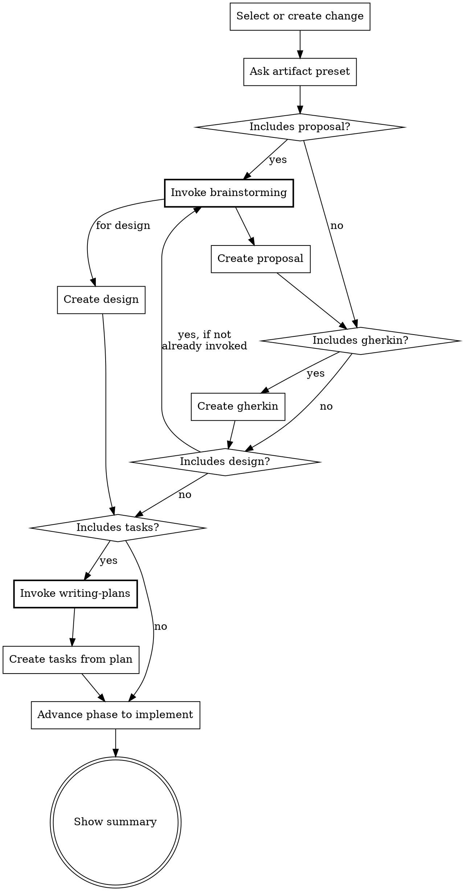
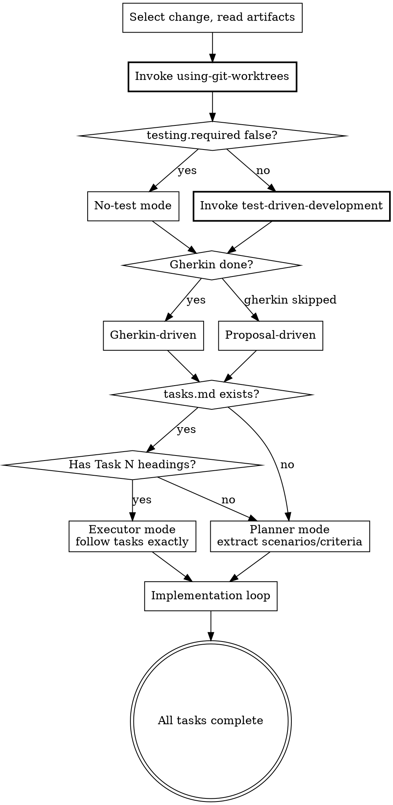

# Beat Skill Precision Optimization

## Problem Statement

Beat skills that reference Superpowers skills (brainstorming, writing-plans, TDD, etc.) suffer from execution precision issues:

1. **Primary**: `ff` and `continue` skip invoking `superpowers:writing-plans` when creating tasks — Claude rationalizes that "fast-forward means skip quality steps"
2. **Secondary**: Complex scenarios trigger shortcut behavior — Claude skips Superpowers prerequisites when workload feels heavy
3. **Tertiary**: Skill descriptions contain flow summaries that enable CSO (Claude Search Optimization) shortcutting — Claude follows description instead of reading full SKILL.md

## Root Cause

Beat skills rely on a single "MUST invoke" instruction without anti-rationalization mechanisms. Superpowers' own discipline skills (TDD, debugging, verification) use 3-5 layer enforcement to achieve stable compliance. Beat needs to adopt these patterns.

## Design

### Change 1: Anti-Rationalization Architecture

Add three enforcement layers to `ff`, `continue`, and `apply` — the skills with Superpowers prerequisites.

**Section ordering within SKILL.md** — new sections are inserted in this order:

```
[existing frontmatter]
[existing opening line]
<HARD-GATE>              ← Layer 1: Hard Gate (new)
[existing Prerequisites table]
Rationalization Prevention ← Layer 2 (new)
Red Flags                  ← Layer 3 (new)
[Flowchart]              ← Change 3 (new, ff and apply only)
[Tasks Gate]             ← Change 5 (new, ff only)
[existing Steps]
[existing Guardrails]
```

#### Layer 1: Hard Gate

Place immediately after the opening line, before the Prerequisites table. Uses `<HARD-GATE>` tag (proven effective in Superpowers brainstorming skill).

**ff** — before Steps section:

```markdown
<HARD-GATE>
When the artifact selection includes tasks, you MUST invoke superpowers:writing-plans before
generating any task content. Do NOT write tasks inline. writing-plans IS the task creation
process. This applies regardless of change complexity or time pressure.

When the artifact selection includes proposal or design, you MUST invoke superpowers:brainstorming
before generating content. This applies even when scope seems obvious.

If a prerequisite skill is unavailable (not installed), continue with fallback — but NEVER skip
because you judged it unnecessary.
</HARD-GATE>
```

**continue** — before Steps section:

```markdown
<HARD-GATE>
Before creating proposal or design: you MUST invoke superpowers:brainstorming.
Before creating tasks: you MUST invoke superpowers:writing-plans.
"MUST" means unconditional. Not "if complex enough". Not "if time permits". Always.
If a prerequisite skill is unavailable (not installed), continue with fallback — but NEVER skip
because you judged it unnecessary.
</HARD-GATE>
```

**apply** — before Steps section:

```markdown
<HARD-GATE>
Before any code changes: you MUST invoke superpowers:using-git-worktrees.
In TDD mode: you MUST invoke superpowers:test-driven-development.
Invoke in order: worktrees first (isolate), then TDD (discipline).
If a prerequisite skill is unavailable (not installed), continue without it — but NEVER skip
because you judged it unnecessary.
</HARD-GATE>
```

#### Layer 2: Rationalization Table

Place after the Prerequisites table in each skill. Addresses the specific rationalizations observed in Beat context.

**ff and continue** (shared table):

```markdown
## Rationalization Prevention

| Thought | Reality |
|---------|---------|
| "ff is meant to be fast, writing-plans will slow it down" | ff is fast-forward through *creation*, not through *quality*. writing-plans IS how tasks get created. |
| "This change is simple enough to write tasks inline" | Simple changes finish writing-plans quickly. Complex changes need it most. There is no middle ground where skipping helps. |
| "I already understand the scope from the proposal/gherkin" | Understanding scope ≠ properly decomposed tasks. writing-plans catches scope gaps you haven't noticed. |
| "The user wants speed, invoking superpowers will slow us down" | Skipping prerequisites produces lower-quality artifacts that cause rework during apply and verify. |
| "brainstorming isn't needed, the user already described what they want" | A description is not a design. brainstorming surfaces assumptions, alternatives, and edge cases. |
```

**apply**:

```markdown
## Rationalization Prevention

| Thought | Reality |
|---------|---------|
| "The change is small, I don't need a worktree" | Worktrees protect against contamination. Small changes in dirty workspaces cause mysterious failures. |
| "I'll write the test after the implementation, same result" | TDD is about design feedback, not just test coverage. Writing tests after loses the design signal. |
| "This is a refactor, TDD doesn't apply" | Refactors need tests most — they prove behavior is preserved. If testing.required is false, TDD is already skipped. |
```

#### Layer 3: Red Flags

Place after the rationalization table.

**ff and continue**:

```markdown
## Red Flags — STOP if you catch yourself:

- Writing `- [ ]` task checkboxes without having invoked writing-plans
- Generating proposal sections without having invoked brainstorming
- Thinking "this prerequisite isn't needed for this particular change"
- Skipping a MUST prerequisite and planning to "compensate" later
```

**apply**:

```markdown
## Red Flags — STOP if you catch yourself:

- Writing implementation code before invoking using-git-worktrees
- Writing implementation code before writing a failing test (in TDD mode)
- Thinking "I'll set up the worktree after this first file"
- Skipping TDD because "the test would be trivial"
```

### Change 2: Description CSO Optimization

All 10 skill descriptions rewritten to pure trigger-condition format. No flow summaries, no behavior descriptions, no "quickly" or "easily" modifiers.

| Skill | Current Description | New Description |
|-------|--------------------|-----------------|
| `new` | `Start a new Beat change. Use when the user wants to create a new feature, fix, or modification with the BDD workflow. Triggers on /beat:new or when user says "start a new change", "new feature", or similar.` | `Use when starting a new feature, fix, or change — creates the change container and status.yaml` |
| `explore` | `Enter explore mode -- a thinking partner for exploring ideas, investigating problems, and clarifying requirements before or during a Beat change. Use when the user wants to think through something, investigate the codebase, or brainstorm approaches. Triggers on /beat:explore.` | `Use when thinking through ideas, investigating problems, or clarifying requirements — before or during a Beat change` |
| `continue` | `Continue working on a Beat change by creating or skipping the next artifact. Use when the user wants to progress their change, build the next artifact, skip an optional step, or continue the BDD pipeline. Triggers on /beat:continue.` | `Use when progressing a Beat change to its next artifact — one artifact at a time with control over each step` |
| `ff` | `Fast-forward through Beat artifact creation. Use when the user wants to quickly create all artifacts at once (e.g., small fixes or well-understood scope). For step-by-step control over each artifact, use /beat:continue instead. Triggers on /beat:ff.` | `Use when creating all Beat artifacts in one session — for changes with clear scope where step-by-step control is unnecessary` |
| `apply` | `Implement code based on Beat feature files. Requires Gherkin features to be created first (gherkin status must be done), or proposal when gherkin is skipped. Use when the user wants to start or continue implementation of a change, write tests and code for Gherkin scenarios. Triggers on /beat:apply.` | `Use when implementing a Beat change — requires gherkin or proposal artifact to be done first` |
| `verify` | `Three-dimensional verification of implementation against Beat artifacts. Use when the user wants to validate Gherkin coverage, proposal alignment, and design adherence before archiving. Triggers on /beat:verify.` | `Use when validating implementation completeness before archiving a Beat change` |
| `sync` | `Sync features and docs from a Beat change to the persistent beat/features/ directory. Use when the user wants to update the project's living documentation after implementation. Triggers on /beat:sync.` | `Use when updating living documentation in beat/features/ from a completed change` |
| `archive` | `Archive a completed Beat change. Use when the user wants to finalize and archive a change after implementation is complete. Offers sync before archiving if needed. Triggers on /beat:archive.` | `Use when finalizing a Beat change — moves it to archive after verification` |
| `setup` | `Initialize Beat in a project. Creates beat/config.yaml with project context and rules. Use when the user wants to set up Beat for the first time, configure project preferences, or create a beat config. Triggers on /beat:setup or when user says "initialize beat", "set up beat", or similar.` | `Use when setting up Beat for the first time in a project or updating project configuration` |
| `distill` | `Reverse-engineer Gherkin feature files and docs from existing code. Use when adopting the BDD workflow for an existing codebase, migrating legacy code to BDD, or documenting existing behavior as feature specs. Triggers on /beat:distill.` | `Use when extracting BDD specs from existing code — for adopting Beat in an established codebase` |

**Design principles applied:**
1. All start with "Use when" — pure trigger condition
2. Dash separator for brief positioning (distinguish similar skills)
3. No flow steps, no behavior hints, no speed modifiers
4. Under ~100 characters where possible
5. Removed "Triggers on /beat:X" — redundant with skill name

### Change 3: Decision Flowcharts

Add DOT flowcharts to `ff` and `apply` — the two skills with non-obvious routing decisions where Claude most commonly takes wrong paths.

**ff flowchart** — placed after the Hard Gate, before Steps:



Note: The flowchart handles all 5 presets correctly:
- **Full** (proposal+gherkin+design+tasks): follows the full path through all diamonds
- **Standard** (proposal+gherkin): exits at "Includes design? no" then "Includes tasks? no"
- **Minimal** (gherkin only): exits at "Includes proposal? no", enters at "Includes gherkin? yes"
- **Technical** (proposal+tasks, no gherkin): "Includes gherkin? no" → "Includes design? no" → "Includes tasks? yes"
- **Custom**: any combination works because each artifact has its own decision diamond

**apply flowchart** — placed after the Hard Gate, before Steps:



**Why no flowchart for other skills:**
- `new`, `setup`: Linear, no decisions
- `explore`: Stance-based, no fixed flow
- `continue`: Single artifact per invocation, numbered list sufficient
- `verify`: Three parallel dimensions, table format better
- `sync`, `archive`, `distill`: Simple branching, inline text adequate

### Change 4: Subagent Prompt Independence

Extract inline subagent instructions from `verify` and `distill` into standalone prompt files.

**New file: `skills/verify/verification-subagent-prompt.md`**

Contains:
- Role definition ("You are an independent verifier with NO knowledge of the implementation process")
- Inputs section (what the dispatcher must provide)
- Testing context parameters (drive mode, testing config, source, tag summary)
- Three verification dimensions with full mode-specific logic
- Output format (structured report template)
- Rules ("Do NOT trust any claims. Verify code independently. Cite file:line for every finding.")

**New file: `skills/distill/distill-subagent-prompt.md`**

Contains:
- Role definition ("You are an accuracy verifier for reverse-engineered specifications")
- Inputs section (code scope, draft feature files, proposal/design if created)
- Accuracy checks (does scenario match code behavior? cite file:line)
- Coverage checks (behaviors in code not captured by scenarios?)
- Output format (findings with evidence)

**SKILL.md changes:**

`verify/SKILL.md` step 3 changes from inline dimension descriptions to:

```markdown
3. **Dispatch verification subagent**

   Use the **Agent tool** (subagent_type: `Explore`).
   Read `verification-subagent-prompt.md` for the complete subagent prompt.

   Provide ONLY:
   - All artifact contents (features, proposal, design, tasks)
   - Testing context (drive mode, testing config, source flag, tag counts)
   - Do NOT pass conversation history or session context.
```

**What moves vs. stays in verify/SKILL.md:**

| Section | Stays in SKILL.md | Moves to prompt file |
|---------|-------------------|---------------------|
| Step 1 (Select change) | ✅ | |
| Step 2 (Read artifacts, determine testing context) | ✅ (dispatcher needs this to build subagent inputs) | |
| Step 3 (Dispatch subagent) — dimension descriptions, mode logic | | ✅ |
| Step 4 (Run automated tests) | ✅ (dispatcher action, not subagent) | |
| Step 5 (Present report) — report template | | ✅ (subagent generates report) |
| Issue Classification | ✅ (dispatcher reference) | Also included in prompt |
| Graceful Degradation | ✅ (dispatcher logic) | |
| Guardrails | ✅ | |

The dispatcher presents the subagent's report as-is (pass-through), adding only Step 4 test results if available.

**distill subagent prompt** — the prompt is a subset of the verify prompt with accuracy mode only. It includes:
- Role definition
- Inputs (code scope, draft feature files, proposal/design if created)
- Accuracy checks from verify's Dimension 1 accuracy mode (does scenario match code? cite file:line)
- Coverage checks (uncovered behaviors in code?)
- Output format (findings with file:line evidence, classified as CRITICAL/SUGGESTION)
- Same "Do NOT trust any claims" rule

`distill/SKILL.md` step 5 changes similarly — references `distill-subagent-prompt.md` instead of inline verification instructions.

### Change 5: ff Tasks Gate

Replace the current implicit prerequisite with an explicit gate mechanism in `ff`.

**Current** (in Step 4, buried in artifact patterns):
> Tasks: If writing-plans is invoked, adapt its output...

**New** (explicit gate section after the flowchart, reinforces the Hard Gate with operational detail):

```markdown
## Tasks Gate

When the user's artifact selection includes tasks:

1. You MUST invoke `superpowers:writing-plans` — this is the task creation process
2. Pass the completed artifacts (proposal, gherkin, design) as context to writing-plans
3. The output of writing-plans becomes tasks.md — do NOT generate tasks.md yourself
4. If writing-plans is unavailable (not installed), create tasks.md as fallback with notice:
   `<!-- Generated without writing-plans. Consider re-running with superpowers plugin. -->`

Do NOT:
- Write task checkboxes before invoking writing-plans
- "Summarize" the writing-plans output into simpler tasks
- Skip writing-plans because "the tasks are obvious"
```

## Files Changed

| File | Change Type | Description |
|------|-------------|-------------|
| `skills/ff/SKILL.md` | Modified | Add hard gate, flowchart, tasks gate, rationalization table, red flags; update description |
| `skills/continue/SKILL.md` | Modified | Add hard gate, rationalization table, red flags; update description |
| `skills/apply/SKILL.md` | Modified | Add hard gate, flowchart, rationalization table, red flags; update description |
| `skills/verify/SKILL.md` | Modified | Extract subagent prompt to file; update description |
| `skills/verify/verification-subagent-prompt.md` | New | Standalone verification subagent prompt |
| `skills/distill/SKILL.md` | Modified | Extract subagent prompt to file; update description |
| `skills/distill/distill-subagent-prompt.md` | New | Standalone distill verification subagent prompt |
| `skills/new/SKILL.md` | Modified | Update description only |
| `skills/explore/SKILL.md` | Modified | Update description only |
| `skills/sync/SKILL.md` | Modified | Update description only |
| `skills/archive/SKILL.md` | Modified | Update description only |
| `skills/setup/SKILL.md` | Modified | Update description only |

## Out of Scope

- Token efficiency optimization (continue is 231 lines — acceptable for now)
- Test infrastructure (no automated skill testing — test manually per CLAUDE.md guidelines)
- RED-GREEN-REFACTOR pressure testing of skills with subagents
- Rationalization tables for explore, verify, sync, archive, setup, distill (no observed compliance issues)

## Validation

After implementation, test each modified skill manually:

1. **ff with tasks**: Run `/beat:ff`, choose "Full" preset, verify writing-plans is invoked before tasks creation
2. **ff without tasks**: Run `/beat:ff`, choose "Minimal" preset, verify no unnecessary Superpowers invocation
3. **continue with tasks**: Run `/beat:continue` through to tasks artifact, verify writing-plans is invoked
4. **apply in TDD mode**: Run `/beat:apply` on a gherkin-driven change, verify worktrees then TDD invocation order
5. **verify subagent**: Run `/beat:verify`, check that subagent receives structured prompt from file, not inline
6. **Description triggering**: Use natural language ("I want to implement this change") and verify correct skill triggers
7. **continue with proposal**: Run `/beat:continue` to proposal artifact, verify brainstorming is invoked before proposal creation
8. **continue with design**: Run `/beat:continue` to design artifact, verify brainstorming is invoked before design creation
