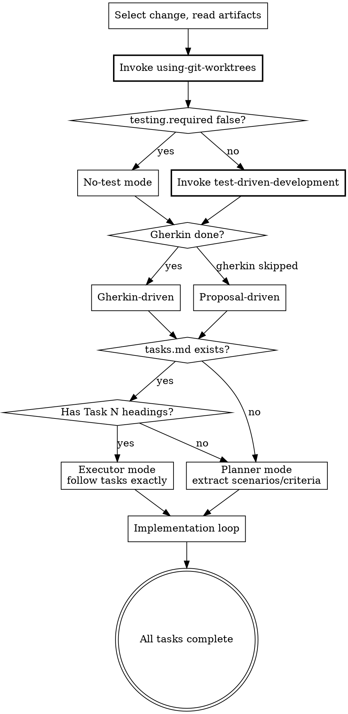

Implement code based on the change artifacts. Supports two modes:

- **Gherkin-driven** (default): feature files drive implementation and testing
- **Proposal-driven**: when gherkin is skipped (technical changes), proposal drives testing

<HARD-GATE>
Before any code changes: you MUST invoke superpowers:using-git-worktrees.
In TDD mode: you MUST invoke superpowers:test-driven-development.
Invoke in order: worktrees first (isolate), then TDD (discipline).
If a prerequisite skill is unavailable (not installed), continue without it — but NEVER skip
because you judged it unnecessary.
</HARD-GATE>

**Prerequisites** (invoke before proceeding)

| Superpower | When | Priority |
|-----------|------|----------|
| using-git-worktrees | At start, before any code changes | MUST |
| test-driven-development | At start, in TDD mode | MUST |
| systematic-debugging | When stuck (3 failed attempts) | SHOULD |
| subagent-driven-development | When tasks.md has multiple independent tasks | SHOULD |

Invoke in order: worktrees first (isolate), then TDD (discipline). Debugging and subagent are conditional — only invoke when triggered. If a superpower is unavailable (skill not installed), skip and continue.

## Rationalization Prevention

| Thought | Reality |
|---------|---------|
| "The change is small, I don't need a worktree" | Worktrees protect against contamination. Small changes in dirty workspaces cause mysterious failures. |
| "I'll write the test after the implementation, same result" | TDD is about design feedback, not just test coverage. Writing tests after loses the design signal. |
| "This is a refactor, TDD doesn't apply" | Refactors need tests most — they prove behavior is preserved. If testing.required is false, TDD is already skipped. |
| "I'll add @covered-by annotations at the end for all scenarios" | Annotations must be added per-scenario immediately after writing the test. Batching them leads to forgetting. |
| "The e2e test setup is too complex, I'll write a unit test instead" | The scenario is tagged @e2e for a reason. If e2e setup is genuinely blocked, announce the blocker and ask — don't silently downgrade. |
| "This @behavior test is obvious, a skeleton is enough" | Every test must be executable. A skeleton that doesn't run is not a test. |

## Red Flags — STOP if you catch yourself:

- Writing implementation code before invoking using-git-worktrees
- Writing implementation code before writing a failing test (in TDD mode)
- Thinking "I'll set up the worktree after this first file"
- Skipping TDD because "the test would be trivial"
- Moving to the next scenario without adding `@covered-by` to the .feature file
- Skipping e2e test creation because "the e2e framework is complex to set up"
- Writing a test skeleton instead of an executable test
- Thinking "I'll add the annotations at the end after all scenarios are done"

## Process Flow



**Input**: Optionally specify a change name. If omitted, infer from context or prompt.

**Steps**

1. **Select the change**

   If no name provided:
   - Look for `beat/changes/` directories (excluding `archive/`)
   - If only one exists, use it (announce: "Using change: <name>")
   - If multiple exist, use **AskUserQuestion tool** to let user select

2. **Read status.yaml and verify readiness** (schema: `references/status-schema.md`)

   Check that either:
   - `gherkin` has `status: done` → **Gherkin-driven mode**
   - `gherkin` has `status: skipped` AND `proposal` has `status: done` → **Proposal-driven mode**

   If neither condition is met: "Features or proposal are required before implementation. Run `/beat:continue` first." STOP.

3. **Read all artifacts and determine testing mode**

   Read in order:
   - `proposal.md` (if exists) -- business context and risk points
   - `features/*.feature` (all files, if gherkin is done) -- implementation targets
   - `design.md` (if exists) -- technical decisions
   - `tasks.md` (if exists) -- implementation checklist

   Read `beat/config.yaml` (if exists, schema: `references/config-schema.md`).

   **Determine testing mode:**
   - If `testing.required: false` → **no-test mode**: skip TDD cycles for all scenarios, write implementation only
   - If `testing.framework` is set → use that framework (skip auto-detection)
   - If `testing` is absent or `testing.required: true` → **TDD mode** (default): require tests for all scenarios except `@no-test`
   - Scenarios tagged `@no-test` → always skip TDD regardless of config

4. **Determine implementation strategy**

   **If tasks.md exists:** Use it as the implementation checklist.
   - **Detailed format** (contains `### Task N:` headings with Steps): Enter **executor mode** — follow each step exactly as written, don't re-plan.
   - **Simple format** (only `- [ ]` checkboxes): Enter **planner mode** — plan each task's implementation yourself (existing behavior).

   **If no tasks.md and Gherkin-driven:** Extract each Scenario from feature files as a unit of work (planner mode).

   **If no tasks.md and Proposal-driven:** Extract success criteria and risk points from proposal.md as units of work (planner mode).

5. **Show implementation overview**

   ```
   ## Implementing: <change-name>

   ### Drive mode: gherkin-driven / proposal-driven
   ### Execution mode: executor / planner
   ### Tasks/Scenarios to implement:
   1. [source] <name>
   2. [source] <name>
   ...
   ```

6. **Implement (loop)**

   For each task (from tasks.md) or scenario (from features) or risk point (from proposal):

   a. **Announce**: "Working on: <description>"

   b. **Write automated test first** (TDD mode only):
      - Skip this step if **no-test mode** or scenario is tagged `@no-test`
      - The test framework: use `testing.framework` from config, or detect from codebase

      **For `@e2e` scenarios (Gherkin-driven):**
      - Generate e2e test or step definitions using the project's e2e framework
      - If the project uses a BDD runner (Cucumber, pytest-bdd, etc.), generate step definitions that bind to the .feature file
      - If no BDD runner, generate a regular e2e test with `@feature`/`@scenario` annotations (same as `@behavior`)

      **For `@behavior` scenarios (Gherkin-driven):**
      - Generate a test file (using `testing.framework` from config, or auto-detect) with annotation comments:
        ```
        @feature: <feature-filename>.feature
        @scenario: <exact scenario name>
        ```
        (Use the project language's comment syntax: `//` for JS/TS/Java/C#, `#` for Python/Ruby, etc.)
      - After writing the test, update the .feature file with a `@covered-by` annotation (placed between the tag and the scenario line):
        ```gherkin
        @behavior @happy-path
        # @covered-by: <relative path to test file>
        Scenario: <name>
        ```

      **For proposal-driven units:**
      - Generate test files covering the risk point using the project's test framework
      - No annotation conventions needed (no features to link to)
      Follow the conventions in `references/testing-conventions.md` for annotation format and e2e test style.

   c. **Write implementation code**:
      - Follow design.md decisions if available
      - Keep changes minimal and focused on the scenario
      - In no-test mode: still write implementation, just without preceding test

   d. **If using tasks.md**: Mark task complete `- [ ]` -> `- [x]`

   e. **Continue to next**

   f. **Scenario completion checklist** (verify before moving to next scenario):

      **For `@e2e` scenarios (TDD mode):**
      - [ ] E2e test or step definition exists and is executable
      - [ ] Test references the scenario (`@feature`/`@scenario` annotations or BDD binding)
      - [ ] `# @covered-by: <path>` annotation added to .feature file (between tag and Scenario line)

      **For `@behavior` scenarios (TDD mode):**
      - [ ] Test file exists with `@feature` and `@scenario` comments
      - [ ] `# @covered-by: <path>` annotation added to .feature file (between tag and Scenario line)
      - [ ] Test is executable (not a skeleton)

      **For all scenarios:**
      - [ ] Implementation code handles the scenario's behavior
      - [ ] Task checkbox marked complete (if using tasks.md)

      Do NOT move to the next scenario until all applicable items are checked.

   **Pause if:**
   - Task/scenario is unclear -> ask for clarification
   - Implementation reveals design issue -> suggest updating artifacts
   - Error or blocker -> report and wait

7. **On completion or pause, show status**

   If all done: update `status.yaml` phase to `verify`
   ```
   ## Implementation Complete

   **Change:** <name>
   **Scenarios:** N/N implemented with tests

   Suggested next steps:
   - `/beat:verify` -- validate implementation against artifacts
   - `/beat:sync` -- sync features to beat/features/
   - `/beat:archive` -- archive the change
   ```

**Testing Rule: Conditional TDD**

**In TDD mode** (default when `testing.required` is true or unset):
- For every Scenario in every .feature file (excluding `@no-test`): there MUST be a corresponding automated test
- `@e2e` scenarios → e2e test or step definitions (using project's e2e framework)
- `@behavior` scenarios → test with `@feature`/`@scenario` annotations + `@covered-by` comment in .feature
- The test MUST be executable (not just a skeleton)
- The test framework: `testing.framework` from config, or auto-detect from codebase
- If the project has a BDD runner (Cucumber, pytest-bdd, etc.), generate step definitions that bind directly to .feature files

**In proposal-driven mode** (gherkin skipped):
- Tests are driven by proposal.md success criteria and risk points
- Each risk point should have corresponding test coverage
- No annotation conventions (no features to link to)

**In no-test mode** (`testing.required: false`):
- Tests are not required. Implementation code is written directly.
- Developers may still write tests voluntarily using `testing.framework` if specified.

**@no-test tag** (per-scenario override):
- Scenarios tagged `@no-test` are always skipped for TDD, even in TDD mode.
- Announce when skipping: "Skipping TDD for <scenario> (@no-test)".

**Guardrails**
- Never implement without reading artifacts first (features in gherkin-driven, proposal in proposal-driven)
- In TDD mode: always write test before implementation (unless @no-test)
- For `@behavior` scenarios: always add `@covered-by` annotation to .feature after writing the test
- For `@behavior` scenarios: always add `@feature`/`@scenario` annotations in the test file
- Keep each change scoped to one scenario/task
- Update task checkbox immediately after completing each task
- Pause on errors, blockers, or unclear requirements -- don't guess
- If implementation reveals issues with features/design, suggest updating artifacts
