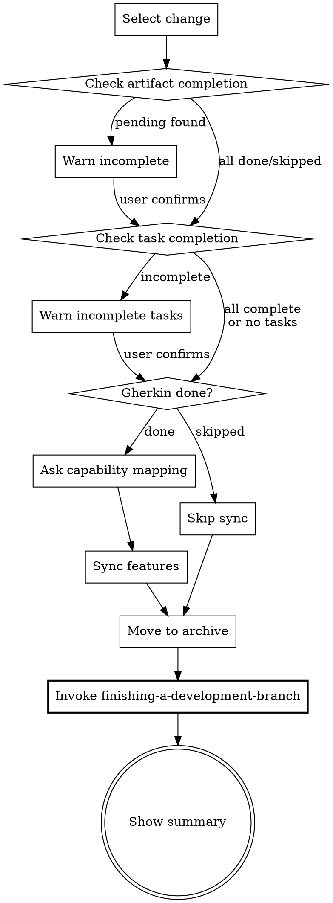

Archive a completed change. Checks completion, syncs features to living documentation, then moves to archive.

<HARD-GATE>
After archive is complete: you MUST invoke superpowers:finishing-a-development-branch
to guide merge/PR/cleanup. If unavailable (not installed), skip and show summary only —
but NEVER skip because you judged the workflow complete without it.
When gherkin status is `done`: you MUST sync features before archiving.
Do NOT skip sync because the user wants speed.
</HARD-GATE>

**Prerequisites** (invoke before proceeding)

| Superpower | When | Priority |
|-----------|------|----------|
| finishing-a-development-branch | After archive is complete | MUST |

If unavailable (skill not installed), skip and show archive summary only.

## Rationalization Prevention

| Thought | Reality |
|---------|---------|
| "The change is already archived, finishing-a-development-branch is optional cleanup" | Archive without branch guidance leaves orphan branches and uncommitted work. The skill ensures nothing is forgotten. |
| "I'll just tell the user to create a PR manually" | finishing-a-development-branch offers structured options (merge, PR, cleanup) tailored to the current state. Manual advice misses context. |
| "Skipping sync is fine, the user can run it later" | There is no separate sync skill. Archive is the only place features get synced. Skipping means features are lost from living documentation. |
| "The .orig backups can be cleaned up later" | Orphaned `.orig` files hide scenarios from BDD runners permanently. Cleanup is part of archive, not a separate step. |

## Red Flags — STOP if you catch yourself:

- Completing archive without invoking finishing-a-development-branch
- Skipping the sync step without checking if gherkin is done
- Moving to archive without asking user about capability mapping (when features exist)
- Completing archive while `.feature.orig` files remain in `beat/features/`

## Process Flow



**Input**: Optionally specify a change name. If omitted, infer from context or prompt.

**Steps**

1. **Select the change**

   If no name provided:
   - Look for `beat/changes/` directories (excluding `archive/`)
   - If only one exists, use it
   - If multiple exist, use **AskUserQuestion tool** to let user select
   - Show only active (non-archived) changes

2. **Check artifact completion**

   Read `beat/changes/<name>/status.yaml` (schema: `references/status-schema.md`).
   Check which artifacts are `done` vs `pending` (not `skipped`).

   **If any non-skipped artifacts are still `pending`:**
   - Display warning listing incomplete artifacts
   - Use **AskUserQuestion tool** to confirm user wants to proceed
   - Proceed if user confirms

3. **Check task completion** (if tasks.md exists)

   Read `tasks.md`. Count `- [ ]` (incomplete) vs `- [x]` (complete).

   **If incomplete tasks found:**
   - Display warning: "N/M tasks incomplete"
   - Use **AskUserQuestion tool** to confirm
   - Proceed if user confirms

4. **Sync features to living documentation**

   Check `status.yaml`:

   **If gherkin status is `skipped`:** Skip sync (no features to sync). Proceed to Step 5.

   **If gherkin status is `done`:**

   Read from `beat/changes/<name>/`:
   - `features/*.feature` (all Gherkin files)
   - `proposal.md` (if exists)
   - `design.md` (if exists)

   If no feature files exist: skip sync, proceed to Step 5.

   Read `beat/config.yaml` if it exists (schema: `references/config-schema.md`). Use `language` for README content language.

   **Determine capability mapping:**

   Use **AskUserQuestion tool**:
   > "Where should each feature be synced? Existing capabilities: [list from beat/features/]. Or enter a new name."

   If only one feature file and the mapping is obvious from context, suggest a default.

   **Sync files:**

   If `beat/features/` doesn't exist, create it: `mkdir -p beat/features`

   | Source (change) | Target (beat/features/) | Behavior |
   |-----------------|------------------------|----------|
   | `features/*.feature` | `beat/features/<capability>/` | Add or update feature files |
   | `proposal.md` | `beat/features/<capability>/proposal.md` | Copy to capability |
   | `design.md` | `beat/features/<capability>/design.md` | Copy to capability |

   **Handle .orig backups** (when `status.yaml` has `gherkin.modified`):

   For each path in `gherkin.modified`:
   1. The modified version is in `changes/<name>/features/` — sync it to `beat/features/<capability>/` (same as new features, unified flow)
   2. Delete the `.feature.orig` backup from `beat/features/`
   3. If the project uses pytest-bdd: update `@scenario` decorator paths in test files (from `beat/changes/.../x.feature` → `beat/features/<capability>/x.feature`)

   Verify no `.feature.orig` files remain in `beat/features/` before proceeding.

   Create `beat/features/<capability>/README.md` if it doesn't exist (placeholder description).
   Create or update `beat/features/README.md` with global navigation.

   Update `status.yaml` phase to `sync`.

5. **Perform the archive**

   Update `status.yaml`: set phase to `archive`.

   ```bash
   mkdir -p beat/changes/archive
   ```

   Generate target name: `YYYY-MM-DD-<change-name>`

   **Check if target already exists:**
   - If yes: fail with error, suggest renaming
   - If no: move the directory

   ```bash
   mv beat/changes/<name> beat/changes/archive/YYYY-MM-DD-<name>
   ```

6. **Show summary**

   ```
   ## Archive Complete

   **Change:** <change-name>
   **Archived to:** beat/changes/archive/YYYY-MM-DD-<name>/
   **Features:** Synced to beat/features/ (or "Sync skipped" or "No features to sync")
   **Artifacts:** N done, M skipped
   **Tasks:** X/Y complete (or "No tasks file")
   ```

7. **Finish the development branch**

   After showing the summary, invoke `superpowers:finishing-a-development-branch` (if available) to guide the user through merge, PR creation, or cleanup. If not available, skip this step.

**Guardrails**
- Always prompt for change selection if not provided
- Don't block archive on warnings -- inform and confirm
- Sync features inline before archiving
- Show clear summary of what happened
- If archive target already exists, don't overwrite
