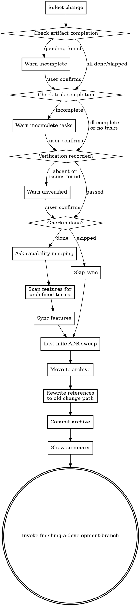

Archive a completed change. Checks completion, syncs features to living documentation, then moves to archive.

**When it runs:** after `/beat:verify` and **before** the PR or merge, on whatever branch the change lives on (normally the worktree branch `/beat:design` created). The archive is the last commit on that branch and ships in the same PR as the code, so `main` never carries an active `beat/changes/<name>` directory for a feature that has already landed. Archive itself hands off to the merge/PR step (step 7) — it is never something to do after the PR is merged. Archive never creates or switches branches: if the user is on the base branch, archive there and let step 7 handle branch state.

<decision_boundary>

**Use for:**
- Archiving a completed (or verified distilled) change
- Syncing features into `beat/features/` living documentation
- Final living-doc sweeps (glossary terms, last-mile ADR) before archiving

**NOT for:**
- Verifying implementation against spec (use `/beat:verify`)
- Implementing remaining tasks (use `/beat:apply`)
- Creating or modifying spec artifacts (use `/beat:design`)
- Waiting for the PR to be merged first — archive is the last commit on the branch, before the PR, and it invokes the merge/PR step itself

**Trigger examples:**
- "Archive the change" / "The change is done, wrap it up" / "Sync the features"
- Should NOT trigger: "verify the implementation" / "implement the change" / "design a feature"

</decision_boundary>

<HARD-GATE>
After archive is complete: you MUST invoke superpowers:finishing-a-development-branch
to guide merge/PR/cleanup. If unavailable (not installed), skip and show summary only —
but NEVER skip because you judged the workflow complete without it.
Before archiving: you MUST check the top-level `verification` field in status.yaml;
if absent or `issues-found`, confirm with the user — inform and confirm, never block.
When gherkin status is `done`: you MUST sync features before archiving.
Before sync: you MUST scan the features being synced for project-specific terms
that are not yet defined in `beat/CONTEXT.md`, and prompt the user to add them.
Before moving to archive: you MUST run the last-mile ADR sweep — if zero ADRs
were written for this change, prompt once before archiving. This applies whether
or not features were synced.
When syncing `design.md` into a capability that already has one: you MUST merge
the change's decisions into the existing document and rewrite it as the current
state — NEVER overwrite it with the change's copy.
After moving the change directory: you MUST rewrite every reference to the old
`beat/changes/<name>` path (ADRs, features, glossary, READMEs, other changes)
to the archived path. A moved directory with dangling links is not archived.
Before invoking finishing-a-development-branch: you MUST commit the archive result
on the current branch (never create or switch one) — archive runs before the
PR/merge, never after it.
Do NOT skip any of these because the user wants speed.
</HARD-GATE>

**Prerequisites** (invoke before proceeding)

| Superpower | When | Priority |
|-----------|------|----------|
| finishing-a-development-branch | After archive is complete | MUST |

If unavailable (skill not installed), skip and show archive summary only.

## Rationalization Prevention

| Thought | Reality |
|---------|---------|
| "The change is already archived, finishing-a-development-branch is optional cleanup" | Archive without branch guidance leaves orphan branches and uncommitted work. The skill ensures nothing is forgotten. |
| "I'll just tell the user to create a PR manually" | finishing-a-development-branch offers structured options (merge, PR, cleanup) tailored to the current state. Manual advice misses context. |
| "Skipping sync is fine, the user can run it later" | There is no separate sync skill. Archive is the only place features get synced. Skipping means features are lost from living documentation. |
| "The .orig backups can be cleaned up later" | Orphaned `.orig` files hide scenarios from BDD runners permanently. Cleanup is part of archive, not a separate step. |
| "Glossary terms can be added later, it's just docs" | Once the features sync into `beat/features/`, the undefined terms become user-facing living documentation. Future readers can't tell which terms are canonical vs. ad hoc. The scan-and-prompt is two minutes — do it before sync. |
| "We didn't write any ADRs but the design.md captures everything" | design.md gets archived with the change. Cross-change decisions need to live in `docs/adr/`. The last-mile sweep is one prompt; if nothing qualifies, it costs nothing. |
| "Verify probably ran at some point, no need to check" | status.yaml records it. If the `verification` field is absent, verify never ran — archiving unverified work silently is exactly the gap the check exists to close. One confirmation prompt, never a block. |
| "The change's design.md is the latest, so copying it over the capability's is correct" | The capability's design.md accumulates decisions from every change that touched it. Overwriting keeps only the last change's view and silently drops everything earlier changes decided. Merge, then rewrite as current state. |
| "The PR isn't merged yet — archive after it lands" | Archive is the last commit on the feature branch and is what invokes finishing-a-development-branch (merge/PR). Archiving after merge leaves an active change directory on `main` and needs a second PR just for housekeeping. Archive now, then let step 7 open the PR. |
| "Links to the old change path will still resolve through git history" | Nobody follows links through git history. Every `beat/changes/<name>` reference in ADRs, features, and READMEs is dead the moment the directory moves. Rewrite them now — it's one grep. |

## Red Flags — STOP if you catch yourself:

- Completing archive without invoking finishing-a-development-branch
- Skipping the sync step without checking if gherkin is done
- Moving to archive without asking user about capability mapping (when features exist)
- Completing archive while `.feature.orig` files remain in `beat/features/`
- Syncing features without first scanning for project-specific terms missing from `beat/CONTEXT.md`
- Archiving a change with zero ADRs without running the last-mile sweep prompt
- Archiving a change with no `verification` record (or `status: issues-found`) without confirming with the user
- Copying the change's `design.md` over an existing `beat/features/<capability>/design.md`
- Finishing archive while any file still references `beat/changes/<name>` (the pre-move path)
- Deferring archive until the PR is merged, or invoking finishing-a-development-branch with the archive result uncommitted

## Process Flow


```dot
digraph archive {
    "Select change" [shape=box];
    "Check artifact completion" [shape=diamond];
    "Warn incomplete" [shape=box];
    "Check task completion" [shape=diamond];
    "Warn incomplete tasks" [shape=box];
    "Verification recorded?" [shape=diamond];
    "Warn unverified" [shape=box];
    "Gherkin done?" [shape=diamond];
    "Ask capability mapping" [shape=box];
    "Scan features for\nundefined terms" [shape=box, style=bold];
    "Sync features" [shape=box];
    "Skip sync" [shape=box];
    "Last-mile ADR sweep" [shape=box, style=bold];
    "Move to archive" [shape=box];
    "Rewrite references\nto old change path" [shape=box, style=bold];
    "Commit archive" [shape=box, style=bold];
    "Show summary" [shape=box];
    "Invoke finishing-a-development-branch" [shape=doublecircle, style=bold];

    "Select change" -> "Check artifact completion";
    "Check artifact completion" -> "Warn incomplete" [label="pending found"];
    "Check artifact completion" -> "Check task completion" [label="all done/skipped"];
    "Warn incomplete" -> "Check task completion" [label="user confirms"];
    "Check task completion" -> "Warn incomplete tasks" [label="incomplete"];
    "Check task completion" -> "Verification recorded?" [label="all complete\nor no tasks"];
    "Warn incomplete tasks" -> "Verification recorded?" [label="user confirms"];
    "Verification recorded?" -> "Warn unverified" [label="absent or\nissues-found"];
    "Verification recorded?" -> "Gherkin done?" [label="passed"];
    "Warn unverified" -> "Gherkin done?" [label="user confirms"];
    "Gherkin done?" -> "Ask capability mapping" [label="done"];
    "Gherkin done?" -> "Skip sync" [label="skipped"];
    "Ask capability mapping" -> "Scan features for\nundefined terms";
    "Scan features for\nundefined terms" -> "Sync features";
    "Sync features" -> "Last-mile ADR sweep";
    "Skip sync" -> "Last-mile ADR sweep";
    "Last-mile ADR sweep" -> "Move to archive";
    "Move to archive" -> "Rewrite references\nto old change path";
    "Rewrite references\nto old change path" -> "Commit archive";
    "Commit archive" -> "Show summary";
    "Show summary" -> "Invoke finishing-a-development-branch";
}
```

**Input**: Optionally specify a change name. If omitted, infer from context or prompt.

**Steps**

1. **Select the change**

   If no name provided:
   - Look for `beat/changes/` directories (excluding `archive/`)
   - If only one exists, use it
   - If multiple exist, use **AskUserQuestion tool** to let user select
   - Show only active (non-archived) changes

2. **Check artifact completion**

   Read `beat/changes/<name>/status.yaml` (schema: `references/status-schema.md`).
   Check which artifacts are `done` vs `pending` (not `skipped`).

   **If any non-skipped artifacts are still `pending`:**
   - Display warning listing incomplete artifacts
   - Use **AskUserQuestion tool** to confirm user wants to proceed
   - Proceed if user confirms

3. **Check task completion** (if tasks.md exists)

   Read `tasks.md`. Count `- [ ]` (incomplete) vs `- [x]` (complete).

   **If incomplete tasks found:**
   - Display warning: "N/M tasks incomplete"
   - Use **AskUserQuestion tool** to confirm
   - Proceed if user confirms

3b. **Check verification ran** (schema: `references/status-schema.md`)

   Read the top-level `verification` field from `status.yaml`:

   - **Absent:** warn "This change was never verified (`/beat:verify` has not run)." Use **AskUserQuestion tool** to confirm archiving anyway.
   - **`status: issues-found`:** warn "Verification found N critical issue(s) on <date>." Use **AskUserQuestion tool** to confirm.
   - **`status: passed`:** proceed silently.

   Inform and confirm — never block.

4. **Sync features to living documentation**

   Check `status.yaml`:

   **If gherkin status is `skipped`:** Skip sync (no features to sync). Proceed to step 4b.

   **If gherkin status is `done`:**

   Read from `beat/changes/<name>/`:
   - `features/*.feature` (all Gherkin files)
   - `proposal.md` (if exists)
   - `design.md` (if exists)

   If no feature files exist: skip sync, proceed to step 4b.

   Read `beat/config.yaml` if it exists (schema: `references/config-schema.md`). Use `language` for README content language.

   **Determine capability mapping:**

   Use **AskUserQuestion tool**:
   > "Where should each feature be synced? Existing capabilities: [list from beat/features/]. Or enter a new name."

   If only one feature file and the mapping is obvious from context, suggest a default.

   **Scan features for undefined terms** (Layer 1 living-doc enforcement):

   Read `beat/CONTEXT.md` if it exists (schema: `references/context-format.md`). The glossary is lazy — it may not exist yet if this is the project's first synced change.

   Scan the feature files being synced for **bolded** project-specific terms. For each term:

   - If it exists in `beat/CONTEXT.md`: OK, continue.
   - If it doesn't: use **AskUserQuestion tool**:
     > "Term '<term>' appears in scenarios but isn't in beat/CONTEXT.md. Add it now?"
     > - Yes (recommended): provide a one-sentence definition; Beat appends it
     > - Skip this term
     > - Skip all remaining (record the count for the summary)

   When the user adds a term, insert it into `beat/CONTEXT.md` where "Where a new entry goes" in `references/context-format.md` says — inside the `## <group>` section it belongs to (or `## Language` for a flat glossary), one-sentence definition, optional `_Avoid_` aliases. Never append it to the end of the file: that lands the term under `## Flagged ambiguities`. Create `beat/CONTEXT.md` lazily if it doesn't exist, writing the full skeleton first.

   If no project-specific bolded terms appear in the scanned features, skip this sub-step silently.

   **Sync files:**

   If `beat/features/` doesn't exist, create it: `mkdir -p beat/features`

   | Source (change) | Target (beat/features/) | Behavior |
   |-----------------|------------------------|----------|
   | `features/*.feature` | `beat/features/<capability>/` | Add or update feature files |
   | `proposal.md` | `beat/features/<capability>/proposal.md` | Copy to capability |
   | `design.md` | `beat/features/<capability>/design.md` | Copy if absent; **merge** if present (see below) |

   When features map to **multiple capabilities**, copy `proposal.md` and `design.md` to the primary capability only (the one receiving the most feature files). On a tie, ask the user which capability owns them. Don't duplicate them across capabilities.

   **Merging `design.md` into an existing capability design:**

   The capability's `design.md` is a **current-state** document that accumulates every change that touched the capability. The change's `design.md` is a **delta** written before implementation. When `beat/features/<capability>/design.md` already exists, never copy over it — read both and rewrite the capability file so it describes the system as it now is:

   1. **Approach** — restate the capability's overall approach as it stands after this change. Fold in this change's approach where it extends the existing one; replace the parts it changed.
   2. **Key Decisions** — keep every existing decision still in force. Add this change's decisions. A decision this change reverses is not deleted: rewrite it as the new decision and note what it superseded (`Supersedes: <old decision> — see <archived change path or ADR>`). Keep existing `See docs/adr/NNNN-slug.md` cross-references.
   3. **Components** — update the component list to match the code after this change (added, removed, renamed).
   4. **History** — append one line under `## History` (create the section if absent): `- YYYY-MM-DD <change-name>: <one-line summary of what the change did>`. This is the only append-only part of the file.

   The result reads as one document: each section appears once, in the capability's existing language and section order, describing the system as it is now. If the two documents genuinely conflict and the code doesn't settle it, use **AskUserQuestion tool** rather than guessing. The change's own `design.md` stays untouched in the change directory and is archived with it.

   **Handle .orig backups** (when `status.yaml` has `gherkin.modified`):

   For each path in `gherkin.modified`:
   1. The modified version is in `changes/<name>/features/` — sync it to `beat/features/<capability>/` (same as new features, unified flow)
   2. Delete the `.feature.orig` backup from `beat/features/`
   3. If the project uses pytest-bdd: update `@scenario` decorator paths in test files (from `beat/changes/.../x.feature` → `beat/features/<capability>/x.feature`)

   Verify no `.feature.orig` files remain in `beat/features/` before proceeding.

   Create `beat/features/<capability>/README.md` if it doesn't exist (placeholder description).
   Create or update `beat/features/README.md` with global navigation.

   Update `status.yaml` phase to `sync`.

4b. **Last-mile ADR sweep** (Layer 2 living-doc enforcement)

   Runs on every path — whether features were synced or sync was skipped.

   Count ADR files written or referenced during this change:
   - Check `docs/adr/` for files created since this change started (git diff against the change's base commit)
   - Scan `design.md` and `tasks.md` for `docs/adr/NNNN-` cross-references

   **If at least one ADR exists for this change:** skip the sweep silently. Earlier triggers (in `/beat:design`, `/beat:plan`, `/beat:apply`) already caught the candidates.

   **If zero ADRs exist for this change:** prompt once using **AskUserQuestion tool**:
   > "No ADRs recorded for this change. Was there any hard-to-reverse + surprising + real-trade-off decision worth recording before archiving?"
   > - No, none qualified
   > - Yes, let me describe it now

   If user describes one, run the three-condition gate from `references/adr-format.md`. If all three hold, follow "Before writing an ADR" in that reference (apply config `rules.adr`; use the project's `docs/adr/TEMPLATE.md` if it exists, otherwise Beat's front-matter template with `source: beat/changes/<name>` — step 5b rewrites it to the archived path) and write the ADR under `docs/adr/` with the next sequential number. If not all three hold, note the skip.

   Either way, proceed to archive.

5. **Perform the archive**

   Update `status.yaml`: set phase to `archive`.

   ```bash
   mkdir -p beat/changes/archive
   ```

   Generate target name: `YYYY-MM-DD-<change-name>`

   **Check if target already exists:**
   - If yes: fail with error, suggest renaming
   - If no: move the directory

   ```bash
   mv beat/changes/<name> beat/changes/archive/YYYY-MM-DD-<name>
   ```

5b. **Rewrite references to the old change path**

   Moving the directory breaks every link that pointed at it: ADR `source` fields and links, `See beat/changes/<name>/...` cross-references in synced features and design docs, glossary or README mentions, and self-references inside the moved directory (e.g. `tasks.md` pointing at its own `design.md`).

   Find them across the repository. Step 5 used plain `mv` and step 4b may have just written an ADR, so the files that matter most are **untracked** at this point — `git grep` skips them unless told otherwise. `--untracked` includes them while still honouring `.gitignore`, so `node_modules`, build output and `.git` are never touched. The trailing group stops `beat/changes/<name>` from matching a different change whose name merely starts the same way (`beat/changes/<name>-v2`):

   ```bash
   git grep -lE --untracked 'beat/changes/<name>(/|[^A-Za-z0-9_-]|$)' -- . ':!beat/changes/archive/YYYY-MM-DD-<name>/status.yaml'
   ```

   In every file listed, replace `beat/changes/<name>` with `beat/changes/archive/YYYY-MM-DD-<name>` — only where the old path is followed by `/`, whitespace, punctuation, or end of line, never where it continues into a longer change name. Use the **Edit tool** per occurrence (`replace_all` is safe only when no `beat/changes/<name>-…` sibling exists in that file), or `sed -E` with the same boundary group when the file count is large. Then re-run the grep: it must return nothing.

   Do not rewrite `status.yaml` inside the archived directory (it records the change by name, not path) and do not touch files under `.git/`.

   Record the number of files rewritten for the summary.

5c. **Commit the archive**

   Everything this run produced is one unit of work and must be committed on the current branch — do not create or switch branches — before step 7 hands off to merge/PR:

   ```bash
   git add beat/changes/            # the moved directory (deletions + new archive path)
   git add beat/features/           # synced features, capability README/proposal/design.md
   git add beat/CONTEXT.md          # glossary terms added in step 4
   git add docs/adr/                # ADRs from the last-mile sweep, plus any ADR index
   git add <files rewritten in 5b>  # references updated to the archived path
   git commit -m "archive(<name>): sync features and archive change"
   ```

   Stage only paths `git status` shows and this run wrote (a path the user modified outside this run stays unstaged). After the commit, `git status` must be clean apart from files unrelated to the archive — finishing-a-development-branch runs the test suite and offers merge/PR on top of this commit; it does not commit for you.

6. **Show summary**

   ```
   ## Archive Complete

   **Change:** <change-name>
   **Archived to:** beat/changes/archive/YYYY-MM-DD-<name>/
   **Verification:** passed / issues-found (N critical) / never run (user confirmed)
   **Features:** Synced to beat/features/ (or "Sync skipped" or "No features to sync")
   **Design doc:** merged into beat/features/<capability>/design.md (or "created" / "no design.md in change")
   **Glossary:** N terms added to beat/CONTEXT.md (or "no changes" / "M terms skipped")
   **ADRs:** N written to docs/adr/ (or "none recorded — last-mile sweep declined")
   **References rewritten:** N files updated from beat/changes/<name> to the archived path (or "none found")
   **Commit:** <sha> archive(<name>): sync features and archive change
   **Artifacts:** N done, M skipped
   **Tasks:** X/Y complete (or "No tasks file")
   ```

7. **Finish the development branch**

   After showing the summary, invoke `superpowers:finishing-a-development-branch` (if available) to guide the user through merge, PR creation, or cleanup. The archive commit from step 5c is already on the branch, so whichever option the user picks carries it. If not available, skip this step.

**Guardrails**
- Always prompt for change selection if not provided
- Don't block archive on warnings -- inform and confirm
- Sync features inline before archiving
- Show clear summary of what happened
- If archive target already exists, don't overwrite
- Never overwrite an existing capability `design.md` — merge and rewrite as current state
- After the move, no tracked file may still reference `beat/changes/<name>`
- Archive runs before the PR/merge and commits its result; it is never deferred until after the PR lands
