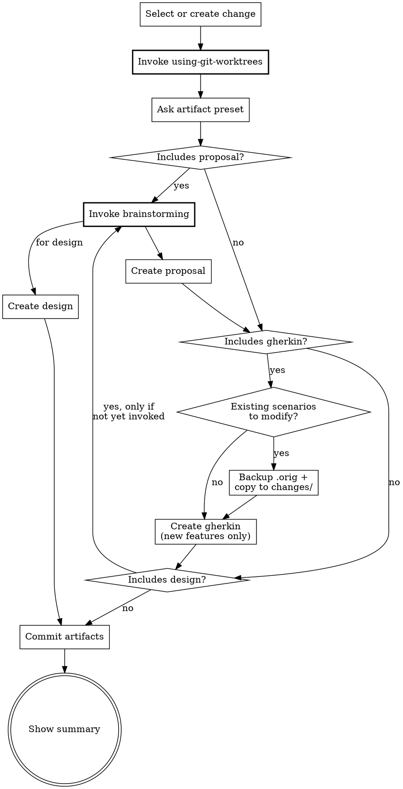

Design a change — create a change container (if needed) and generate spec artifacts.

<decision_boundary>

**Use for:**
- Creating a new Beat change and generating spec artifacts (proposal, gherkin, design.md)
- Resuming artifact generation for an existing change that has pending spec artifacts
- Choosing which spec artifacts to include (presets: Full, Standard, Minimal, Technical, Custom)

**NOT for:**
- Breaking down tasks or creating execution plans (use `/beat:plan`)
- Exploring ideas or thinking through a problem before committing (use `/beat:explore`)
- Implementing code (use `/beat:apply`)
- Reviewing or verifying implementation (use `/beat:verify`)

**Trigger examples:**
- "Design a user authentication feature" / "Create a change for login" / "Generate specs for X"
- Should NOT trigger: "break down the tasks" / "let me think about this" / "implement the change"

</decision_boundary>

<HARD-GATE>
Before writing any artifact files: you MUST invoke superpowers:using-git-worktrees.
When the artifact selection includes proposal or design, you MUST invoke superpowers:brainstorming
before generating content. This applies even when scope seems obvious.

Invoke in order: worktrees first (isolate), then brainstorming (design).

If a prerequisite skill is unavailable (not installed), continue with fallback — but NEVER skip
because you judged it unnecessary.
</HARD-GATE>

**Prerequisites** (invoke before proceeding)

| Superpower | When | Priority |
|-----------|------|----------|
| using-git-worktrees | Before first file write | MUST |
| brainstorming | Before creating proposal or design | MUST |

If a superpower is unavailable (skill not installed), skip and continue.

## Rationalization Prevention

| Thought | Reality |
|---------|---------|
| "I don't need a worktree for just writing specs" | Without a worktree, artifacts live in the main workspace and won't carry into apply. Isolate from the start. |
| "brainstorming isn't needed, the user already described what they want" | A description is not a design. brainstorming surfaces assumptions, alternatives, and edge cases. |
| "The user wants speed, invoking superpowers will slow us down" | Skipping prerequisites produces lower-quality artifacts that cause rework during apply and verify. |
| "This change is simple enough to skip brainstorming" | Simple changes finish brainstorming quickly. Complex changes need it most. There is no middle ground where skipping helps. |

## Red Flags — STOP if you catch yourself:

- Writing any file before invoking using-git-worktrees
- Generating proposal sections without having invoked brainstorming
- Creating design.md without invoking brainstorming first
- Writing gherkin scenarios that contain internal method names, numeric thresholds, or implementation constants
- Modifying an existing feature in `beat/features/` without creating a `.orig` backup first
- Writing tasks.md or `- [ ]` checkboxes — tasks belong in `/beat:plan`
- Thinking "this prerequisite isn't needed for this particular change"

## Process Flow



**Input**: Change name (kebab-case) OR a description of what to build. Can also be an existing change name to fast-forward remaining artifacts.

**Steps**

1. **If no clear input provided, ask what they want to build**

   Use **AskUserQuestion tool** to ask what they want to build.
   Derive kebab-case name from description.

2. **Create or select change**

   Determine the change name. Before creating any files, invoke `using-git-worktrees` to isolate this change.

   - If `beat/changes/<name>/` doesn't exist: create it (directory + status.yaml + features/.gitkeep)
   - If it exists: use it, read `status.yaml` (schema: `references/status-schema.md`) to find remaining artifacts

3. **Ask which spec artifacts to include**

   Read `status.yaml`. For artifacts still `pending`, ask user once upfront:

   Use **AskUserQuestion tool**:
   > "Which spec artifacts do you want? (Tasks are handled separately by `/beat:plan`)"
   > 1. Full: Proposal + Gherkin + Design (recommended for large features)
   > 2. Standard: Proposal + Gherkin (recommended for medium features)
   > 3. Minimal: Gherkin only (recommended for small bug fixes)
   > 4. Technical: Proposal only, no Gherkin (for tooling/infra/refactor changes with no behavior change)
   > 5. Custom: Let me choose each one

   Mark skipped artifacts as `skipped` in `status.yaml`.
   Tasks are always set to `pending` — task breakdown happens in `/beat:plan`.
   Update `phase` to match the latest completed spec artifact after each creation.

4. **Create artifacts in pipeline order**

   Read `beat/config.yaml` if it exists (schema: `references/config-schema.md`). Use `language` for artifact output language, inject `context`, and apply matching `rules` per artifact type throughout creation.

   For each artifact to create (pipeline order: proposal -> gherkin -> design):
   - Read all completed artifacts for context
   - Invoke prerequisites per the table above (brainstorming before proposal/design — invoke once before the first artifact that needs it; skip for subsequent artifacts if already invoked)
   - Create the artifact following the patterns below
   - Update `status.yaml`
   - Show brief progress: "Created <artifact>"
   - If context is critically unclear, pause and ask

   **Artifact patterns:**
   - **Proposal**: Sections: `## Why`, `## What Changes`, `## Impact`
   - **Gherkin**:
     - Read `references/feature-writing.md` for conventions on description blocks, scenario organization, and review checklist
     - Before writing, scan `beat/features/**/*.feature` and `beat/changes/*/features/*.feature` (excluding current change) — read `Feature:` and `Scenario:` lines to map existing coverage, deep-read only overlapping features, avoid duplication and align style
     - SpecFlow style, tags `@happy-path`/`@error-handling`/`@edge-case`
     - Feature description carries PRD essence (must include: As a / I want / So that)
     - Every scenario MUST have a testing layer tag: `@e2e` (user journeys needing a running app) or `@behavior` (business logic testable without a full app; default `@behavior`)
     - Write at behavior level — describe what the system does ("Monthly billing adjusts for short months"), not how a function works ("calculateNextTransactionDate clamps to last day")
     - Use business language — no concrete numeric thresholds, code method names, or internal constants (API contract constants are OK as shared vocabulary)
     - Repeated Given steps use `Background:`
     - Tags must serve a filtering purpose — no decorative tags
     - BDD focuses on high-level acceptance; boundary values and algorithm details belong in unit tests
     - If option 4 (Technical) was chosen, skip gherkin entirely

     **Modifying existing features** (see `references/testing-conventions.md` for full mechanism):

     When the scan reveals scenarios in `beat/features/` that need modification:

     1. **Conflict check**: scan `beat/features/**/*.feature.orig` — if a `.orig` exists for the same file, another change is modifying it. Warn and stop.
     2. **Backup**: rename the original in `beat/features/` to `.feature.orig` (hides it from BDD runners)
     3. **Copy**: copy the original content to `beat/changes/<name>/features/<file>.feature`
     4. **Modify**: edit the scenario(s) in the `changes/` copy (add/change/remove steps, add new scenarios)
     5. **Record**: add the original path to `status.yaml` `gherkin.modified` array

     New features that don't modify existing scenarios go directly to `changes/<name>/features/` as before.
   - **Design**: Sections: `## Approach`, `## Key Decisions`, `## Components`

5. **Commit artifacts and show final status**

   Commit all change artifacts: `git add beat/changes/<name>/ && git commit`

   Update phase to the latest completed spec artifact in `status.yaml`.

   ```
   ## Design Complete: <change-name>

   Created:
   - proposal.md (or skipped)
   - features/*.feature (or skipped if Technical option)
   - design.md (or skipped)

   Tasks: pending (run `/beat:plan` to create execution plan)

   Spec artifacts ready! Review them, then run `/beat:plan` for task breakdown.
   ```

**Guardrails**
- Gherkin is mandatory by default -- only skip for purely technical changes (option 4: Technical)
- Ask upfront which artifacts to include (don't ask per artifact)
- If change already exists with some artifacts done, only create remaining
- If context is critically unclear, ask -- but prefer reasonable defaults to keep momentum
- Verify each artifact file exists after writing before proceeding
- Tasks are NOT created in this skill — they are handled by `/beat:plan`
