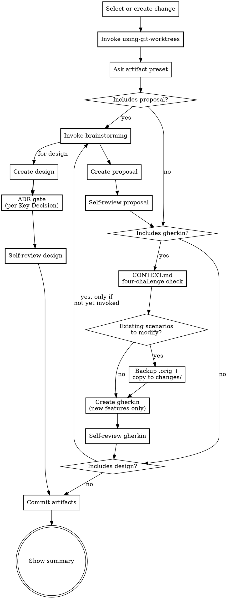

Design a change — create a change container (if needed) and generate spec artifacts.

<decision_boundary>

**Use for:**
- Creating a new Beat change and generating spec artifacts (proposal, gherkin, design.md)
- Resuming artifact generation for an existing change that has pending spec artifacts
- Choosing which spec artifacts to include (presets: Full, Standard, Minimal, Technical, Custom)

**NOT for:**
- Breaking down tasks or creating execution plans (use `/beat:plan`)
- Exploring ideas or thinking through a problem before committing (use `/beat:explore`)
- Implementing code (use `/beat:apply`)
- Reviewing or verifying implementation (use `/beat:verify`)

**Trigger examples:**
- "Design a user authentication feature" / "Create a change for login" / "Generate specs for X"
- Should NOT trigger: "break down the tasks" / "let me think about this" / "implement the change"

</decision_boundary>

<HARD-GATE>
Before writing any artifact files: you MUST invoke superpowers:using-git-worktrees.
When the artifact selection includes proposal or design, you MUST invoke superpowers:brainstorming
before generating content. This applies even when scope seems obvious.

Before writing gherkin scenarios: you MUST run the four-challenge CONTEXT.md check
(see step 4 below) and ensure every project-specific term used in scenarios is
defined in `beat/CONTEXT.md`. Create the glossary lazily — only when the first
term is added.

After writing each artifact: you MUST run the four-check spec self-review
(placeholder / consistency / scope / ambiguity). Fix issues inline.

While writing `design.md`: you MUST run the three-condition ADR gate
(hard-to-reverse + surprising + real trade-off — see `references/adr-format.md`)
on each Key Decision. When all three hold, offer to lift the decision into a
new ADR under `docs/adr/`. The user may decline.

Invoke in order: worktrees first (isolate), then brainstorming (design).

If a prerequisite skill is unavailable (not installed), continue with fallback — but NEVER skip
because you judged it unnecessary.
</HARD-GATE>

**Prerequisites** (invoke before proceeding)

| Skill | When | Priority |
|-------|------|----------|
| superpowers:using-git-worktrees | Before first file write | MUST |
| superpowers:brainstorming | Before creating proposal or design | MUST |
| mattpocock-skills:grill-with-docs | When CONTEXT.md ambiguity is complex enough that a full grilling session is warranted | OPTIONAL |

If a prerequisite skill is unavailable (skill not installed), skip and continue.
For optional skills (grill-with-docs), offer to invoke when applicable; if the
user declines or it isn't installed, proceed with the four-challenge check inline.

## Rationalization Prevention

| Thought | Reality |
|---------|---------|
| "I don't need a worktree for just writing specs" | Without a worktree, artifacts live in the main workspace and won't carry into apply. Isolate from the start. |
| "brainstorming isn't needed, the user already described what they want" | A description is not a design. brainstorming surfaces assumptions, alternatives, and edge cases. |
| "The user wants speed, invoking superpowers will slow us down" | Skipping prerequisites produces lower-quality artifacts that cause rework during apply and verify. |
| "This change is simple enough to skip brainstorming" | Simple changes finish brainstorming quickly. Complex changes need it most. There is no middle ground where skipping helps. |
| "The domain terms are obvious, no need to update CONTEXT.md" | Obvious to you, not to future-you or anyone else reading the feature in six months. Glossary entries are two lines. Add them inline. |
| "Spec self-review is overkill, the artifact is short" | Self-review catches placeholders, contradictions, and ambiguities that compound through plan and apply. The four checks take 30 seconds. |
| "This decision is just for this change, no ADR needed" | Run the three-condition gate. If it's hard-to-reverse, surprising, and a real trade-off, future changes will trip over it — that's the ADR's job. Decisions that *are* change-specific don't pass the gate; let the gate decide, not your gut. |
| "We'll lift this into an ADR later" | "Later" rarely arrives. The decision is fresh now; the ADR is 1-3 sentences. Write it inline. |

## Red Flags — STOP if you catch yourself:

- Writing any file before invoking using-git-worktrees
- Generating proposal sections without having invoked brainstorming
- Creating design.md without invoking brainstorming first
- Writing gherkin scenarios that contain internal method names, numeric thresholds, or implementation constants
- Writing gherkin scenarios that use project-specific domain terms not defined in `beat/CONTEXT.md`
- Modifying an existing feature in `beat/features/` without creating a `.orig` backup first
- Writing tasks.md or `- [ ]` checkboxes — tasks belong in `/beat:plan`
- Skipping the spec self-review because the artifact "looks fine"
- Writing a Key Decision in `design.md` that meets all three ADR conditions without offering an ADR
- Thinking "this prerequisite isn't needed for this particular change"

## Process Flow


```dot
digraph design {
    "Select or create change" [shape=box];
    "Invoke using-git-worktrees" [shape=box, style=bold];
    "Ask artifact preset" [shape=box];
    "Includes proposal?" [shape=diamond];
    "Invoke brainstorming" [shape=box, style=bold];
    "Create proposal" [shape=box];
    "Self-review proposal" [shape=box, style=bold];
    "Includes gherkin?" [shape=diamond];
    "CONTEXT.md\nfour-challenge check" [shape=box, style=bold];
    "Existing scenarios\nto modify?" [shape=diamond];
    "Backup .orig +\ncopy to changes/" [shape=box];
    "Create gherkin\n(new features only)" [shape=box];
    "Self-review gherkin" [shape=box, style=bold];
    "Includes design?" [shape=diamond];
    "Create design" [shape=box];
    "ADR gate\n(per Key Decision)" [shape=box, style=bold];
    "Self-review design" [shape=box, style=bold];
    "Commit artifacts" [shape=box];
    "Show summary" [shape=doublecircle];

    "Select or create change" -> "Invoke using-git-worktrees";
    "Invoke using-git-worktrees" -> "Ask artifact preset";
    "Ask artifact preset" -> "Includes proposal?";
    "Includes proposal?" -> "Invoke brainstorming" [label="yes"];
    "Includes proposal?" -> "Includes gherkin?" [label="no"];
    "Invoke brainstorming" -> "Create proposal";
    "Create proposal" -> "Self-review proposal";
    "Self-review proposal" -> "Includes gherkin?";
    "Includes gherkin?" -> "CONTEXT.md\nfour-challenge check" [label="yes"];
    "Includes gherkin?" -> "Includes design?" [label="no"];
    "CONTEXT.md\nfour-challenge check" -> "Existing scenarios\nto modify?";
    "Existing scenarios\nto modify?" -> "Backup .orig +\ncopy to changes/" [label="yes"];
    "Existing scenarios\nto modify?" -> "Create gherkin\n(new features only)" [label="no"];
    "Backup .orig +\ncopy to changes/" -> "Create gherkin\n(new features only)";
    "Create gherkin\n(new features only)" -> "Self-review gherkin";
    "Self-review gherkin" -> "Includes design?";
    "Includes design?" -> "Invoke brainstorming" [label="yes, only if\nnot yet invoked"];
    "Includes design?" -> "Commit artifacts" [label="no"];
    "Invoke brainstorming" -> "Create design" [label="for design"];
    "Create design" -> "ADR gate\n(per Key Decision)" [style=bold];
    "ADR gate\n(per Key Decision)" -> "Self-review design";
    "Self-review design" -> "Commit artifacts";
    "Commit artifacts" -> "Show summary";
}
```

**Input**: Change name (kebab-case) OR a description of what to build. Can also be an existing change name to fast-forward remaining artifacts.

**Steps**

1. **If no clear input provided, ask what they want to build**

   Use **AskUserQuestion tool** to ask what they want to build.
   Derive kebab-case name from description.

2. **Create or select change**

   Determine the change name. Before creating any files, invoke `using-git-worktrees` to isolate this change.

   - If `beat/changes/<name>/` doesn't exist: create it (directory + status.yaml + features/.gitkeep)
   - If it exists: use it, read `status.yaml` (schema: `references/status-schema.md`) to find remaining artifacts

3. **Ask which spec artifacts to include**

   Read `status.yaml`. For artifacts still `pending`, ask user once upfront:

   Use **AskUserQuestion tool**:
   > "Which spec artifacts do you want? (Tasks are handled separately by `/beat:plan`)"
   > 1. Full: Proposal + Gherkin + Design (recommended for large features)
   > 2. Standard: Proposal + Gherkin (recommended for medium features)
   > 3. Minimal: Gherkin only (recommended for small bug fixes)
   > 4. Technical: Proposal only, no Gherkin (for tooling/infra/refactor changes with no behavior change)
   > 5. Custom: Let me choose each one

   Mark skipped artifacts as `skipped` in `status.yaml`.
   Tasks are always set to `pending` — task breakdown happens in `/beat:plan`.
   Update `phase` to match the latest completed spec artifact after each creation.

4. **Create artifacts in pipeline order**

   Read `beat/config.yaml` if it exists (schema: `references/config-schema.md`). Use `language` for artifact output language, inject `context`, and apply matching `rules` per artifact type throughout creation.

   For each artifact to create (pipeline order: proposal -> gherkin -> design):
   - Read all completed artifacts for context
   - Invoke prerequisites per the table above (brainstorming before proposal/design — invoke once before the first artifact that needs it; skip for subsequent artifacts if already invoked)
   - **Gherkin only — before writing scenarios:** run the CONTEXT.md four-challenge check (see sub-step below)
   - Create the artifact following the patterns below
   - **After writing:** run the spec self-review (see sub-step below); fix issues inline
   - Update `status.yaml`
   - Show brief progress: "Created <artifact>"
   - If context is critically unclear, pause and ask

   **CONTEXT.md four-challenge check** (before writing gherkin):

   Read `beat/CONTEXT.md` if it exists (schema: `references/context-format.md`). Create it lazily when the first term is added — never preemptively.

   Walk through the brainstorming output and any draft scenario text. For each project-specific term, run these checks and update `beat/CONTEXT.md` **inline** as findings emerge (never batch):

   1. **Against the glossary** — the term conflicts with an existing entry? Call it out, resolve, update.
   2. **Sharpen fuzzy** — the term is vague or overloaded (e.g. "account" meaning Customer and User both)? Pick the canonical word, list the others as `_Avoid_`.
   3. **Stress-test** — invent edge-case scenarios that probe term boundaries; force the boundary to be named.
   4. **Cross-reference code** — the user states behaviour that the code contradicts? Surface, decide source of truth, update the loser.

   **Optional grilling:** If `mattpocock-skills:grill-with-docs` is installed and the ambiguity is complex enough to warrant a full grilling session, offer to invoke it once: *"Want to drop into grill-with-docs for a deeper pass on this?"* If the user declines, or the skill isn't installed, continue inline with the four challenges. Beat never hard-requires grill-with-docs.

   Every project-specific term used in scenarios MUST exist in `beat/CONTEXT.md` before the scenario is written. Bolded terms in scenarios are the canonical form.

   **Spec self-review** (after writing each artifact):

   Re-read the artifact with fresh eyes and check:

   1. **Placeholder scan** — any `TBD`, `TODO`, incomplete sections, vague requirements?
   2. **Internal consistency** — do sections contradict each other? Does the design match the gherkin scenarios?
   3. **Scope check** — is this focused enough for a single implementation plan, or does it need decomposition?
   4. **Ambiguity check** — could any requirement be read two different ways? If so, pick one and make it explicit.

   Fix issues inline. No need to re-review the fix — just fix and move on.

   **Artifact patterns:**
   - **Proposal**: Sections: `## Why`, `## What Changes`, `## Impact`
   - **Gherkin**:
     - Read `references/feature-writing.md` for conventions on description blocks, scenario organization, and review checklist
     - Before writing, scan `beat/features/**/*.feature` and `beat/changes/*/features/*.feature` (excluding current change) — read `Feature:` and `Scenario:` lines to map existing coverage, deep-read only overlapping features, avoid duplication and align style
     - SpecFlow style, tags `@happy-path`/`@error-handling`/`@edge-case`
     - Feature description carries PRD essence (must include: As a / I want / So that)
     - Every scenario MUST have a testing layer tag: `@e2e` (user journeys needing a running app) or `@behavior` (business logic testable without a full app; default `@behavior`)
     - Write at behavior level — describe what the system does ("Monthly billing adjusts for short months"), not how a function works ("calculateNextTransactionDate clamps to last day")
     - Use business language — no concrete numeric thresholds, code method names, or internal constants (API contract constants are OK as shared vocabulary)
     - Repeated Given steps use `Background:`
     - Tags must serve a filtering purpose — no decorative tags
     - BDD focuses on high-level acceptance; boundary values and algorithm details belong in unit tests
     - If option 4 (Technical) was chosen, skip gherkin entirely

     **Modifying existing features** (see `references/testing-conventions.md` for full mechanism):

     When the scan reveals scenarios in `beat/features/` that need modification:

     1. **Conflict check**: scan `beat/features/**/*.feature.orig` — if a `.orig` exists for the same file, another change is modifying it. Warn and stop.
     2. **Backup**: rename the original in `beat/features/` to `.feature.orig` (hides it from BDD runners)
     3. **Copy**: copy the original content to `beat/changes/<name>/features/<file>.feature`
     4. **Modify**: edit the scenario(s) in the `changes/` copy (add/change/remove steps, add new scenarios)
     5. **Record**: add the original path to `status.yaml` `gherkin.modified` array

     New features that don't modify existing scenarios go directly to `changes/<name>/features/` as before.
   - **Design**:
     - Sections: `## Approach`, `## Key Decisions`, `## Components`
     - **ADR gate** — for each Key Decision, run the three-condition check from `references/adr-format.md`:
       1. Hard to reverse? (cost of changing your mind is meaningful)
       2. Surprising without context? (future reader will wonder *"why on earth this way?"*)
       3. Result of a real trade-off? (genuine alternatives existed)
       If **all three** hold, use **AskUserQuestion tool**: *"This decision meets the ADR gate. Lift it into `docs/adr/`?"* On Yes, write a 1-3 sentence ADR using the template in `references/adr-format.md`, increment the highest existing number in `docs/adr/` by one, and add a cross-reference from `design.md` (`See docs/adr/NNNN-slug.md`). On No, continue.
       Create `docs/adr/` lazily — only on first ADR.

5. **Commit artifacts and show final status**

   Commit all change artifacts: `git add beat/changes/<name>/ && git commit`

   Update phase to the latest completed spec artifact in `status.yaml`.

   ```
   ## Design Complete: <change-name>

   Created:
   - proposal.md (or skipped)
   - features/*.feature (or skipped if Technical option)
   - design.md (or skipped)

   Tasks: pending (run `/beat:plan` to create execution plan)

   Spec artifacts ready! Review them, then run `/beat:plan` for task breakdown.
   ```

**Guardrails**
- Gherkin is mandatory by default -- only skip for purely technical changes (option 4: Technical)
- Ask upfront which artifacts to include (don't ask per artifact)
- If change already exists with some artifacts done, only create remaining
- If context is critically unclear, ask -- but prefer reasonable defaults to keep momentum
- Verify each artifact file exists after writing before proceeding
- Tasks are NOT created in this skill — they are handled by `/beat:plan`
