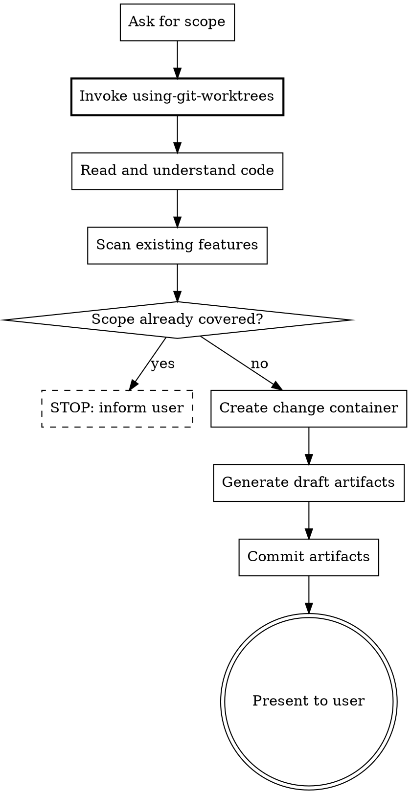

Distill — reverse-engineer Gherkin feature files from existing code.

Use this to bring existing codebases into the Beat workflow. The output is draft `.feature` files that describe **current behavior** (not aspirational), verified independently by `/beat:verify`.

<decision_boundary>

**Use for:**
- Extracting BDD specs from an existing codebase that doesn't have feature files yet
- Bringing a module, directory, or functionality into the Beat workflow retroactively
- Generating draft `.feature` files that describe what the code currently does

**NOT for:**
- Designing new behavior or features (use `/beat:design`)
- Writing aspirational specs for code that doesn't exist yet (use `/beat:design`)
- Greenfield projects with no existing code to distill
- Exploring ideas or thinking through a problem (use `/beat:explore`)

**Trigger examples:**
- "Distill the auth module into feature files" / "Extract specs from existing code" / "Bring this codebase into Beat"
- Should NOT trigger: "design a new feature" / "write specs for something we want to build" / "explore this idea"

</decision_boundary>

<HARD-GATE>
Before writing any artifact files: you MUST invoke superpowers:using-git-worktrees.
Distilled artifacts live in a change container that may later flow through plan → apply → archive.
Worktree isolation ensures they don't contaminate the main workspace.

If a prerequisite skill is unavailable (not installed), continue with fallback — but NEVER skip
because you judged it unnecessary.
</HARD-GATE>

**Prerequisites** (invoke before proceeding)

| Superpower | When | Priority |
|-----------|------|----------|
| using-git-worktrees | Before first file write | MUST |

If a superpower is unavailable (skill not installed), skip and continue.

## Rationalization Prevention

| Thought | Reality |
|---------|---------|
| "I don't need a worktree for just writing feature files" | Distilled artifacts flow into plan/apply/archive. Without isolation, they won't carry forward correctly. |
| "The code is simple, I can verify the scenarios myself" | Self-verification of distilled specs is explicitly forbidden. Always use `/beat:verify` for independent accuracy checking. |
| "I'll skip scanning existing features, this is a new area" | Existing features may already cover this behavior. Distilling duplicates creates maintenance burden. |
| "These scenarios are obviously correct, verification is overkill" | Distill extracts specs from code — the most likely error is describing aspirational behavior instead of current behavior. Verification catches this. |
| "I'll commit later, let me just generate the files first" | Uncommitted artifacts can be lost. Commit before presenting to the user, matching design's behavior. |

## Red Flags — STOP if you catch yourself:

- Writing any file before invoking using-git-worktrees
- Writing scenarios that describe desired behavior instead of current behavior
- Skipping the existing feature scan
- Claiming verification passed without running `/beat:verify`
- Finishing without committing artifacts
- Writing Gherkin scenarios that contain internal method names, numeric thresholds, or implementation constants
- Thinking "I know the code well enough to skip verification"

## Process Flow



**Input**: User specifies the code scope to distill (module, directory, or functionality).

**Steps**

1. **Ask for scope**

   If not specified, use **AskUserQuestion tool**:
   > "What code do you want to distill into BDD specs? Specify a module, directory, or describe the functionality."

2. **Ensure worktree isolation**

   Invoke `using-git-worktrees` before reading or writing any files.

3. **Read and understand the code**

   Read the specified code. Map out:
   - User-visible behaviors (functionality)
   - Edge cases handled
   - Error conditions
   - Existing tests (if any) that reveal behavior

4. **Scan existing features**

   Scan `beat/features/**/*.feature` and `beat/changes/*/features/*.feature` (excluding archive):
   - Read `Feature:` and `Scenario:` lines to map existing coverage
   - Deep-read only features that overlap with the distill scope
   - Note which behaviors are already covered — do NOT distill duplicates
   - If the scope is entirely covered: inform user and STOP

5. **Create a change container**

   Create `beat/changes/distill-<scope-name>/` with `status.yaml` (schema: `references/status-schema.md`):
   ```yaml
   name: distill-<scope-name>
   created: YYYY-MM-DD
   phase: new
   source: distill
   pipeline:
     proposal: { status: pending }
     gherkin: { status: pending }
     design: { status: pending }
     tasks: { status: pending }
   ```

6. **Generate draft artifacts**

   Read `beat/config.yaml` if it exists (schema: `references/config-schema.md`). Use `language` for artifact output language, inject `context` as project background, and apply matching `rules` per artifact type (e.g., `rules.gherkin`, `rules.proposal`, `rules.design`).

   **features/*.feature (mandatory):**
   - Read `references/feature-writing.md` for conventions on description blocks, scenario organization, and review checklist
   - Write feature files describing CURRENT behavior (not desired behavior)
   - Each scenario must accurately reflect what the code actually does
   - Use tags: `@distilled` (always), plus `@happy-path`, `@error-handling`, `@edge-case`
   - Every scenario MUST have a testing layer tag (`@e2e` or `@behavior`, default `@behavior`)
   - If behavior is ambiguous, note it as uncertain rather than guessing

   **proposal.md (optional):**
   - If the purpose is clear from code/docs: write a brief "why this exists" proposal
   - Sections: `## Why`, `## What Changes`, `## Impact`

   **design.md (optional):**
   - Document the current technical architecture and key decisions visible in the code
   - Sections: `## Approach`, `## Key Decisions`, `## Components`

   Update `status.yaml` for each artifact created. Set phase to the latest completed spec artifact.

7. **Commit artifacts**

   Commit all change artifacts: `git add beat/changes/distill-<scope-name>/ && git commit`

   Use a descriptive message: "distill(<scope>): extract BDD specs from existing code"

8. **Present to user for review**

   Show:
   - All generated feature files (summary of scenarios per feature)
   - Any remaining uncertainties about behavior
   - Existing features that overlap (from step 4 scan)

   ```
   ## Distill Complete: distill-<scope-name>

   Created:
   - features/*.feature (N scenarios across M files)
   - proposal.md (or skipped)
   - design.md (or skipped)

   Uncertainties: [list any ambiguous behaviors]

   Next steps:
   - Review the draft feature files for accuracy
   - Run `/beat:verify` to independently verify scenarios match code behavior
   - Then `/beat:plan` → `/beat:apply` for future changes using the normal BDD flow
   ```

**Distill vs Normal Flow**

```
Normal:  Spec -> Code   (write spec first, then implement)
Distill: Code -> Spec   (extract spec from existing code)
              |
         /beat:verify confirms accuracy (source: distill → accuracy mode)
              |
         Future changes use normal BDD flow
```

