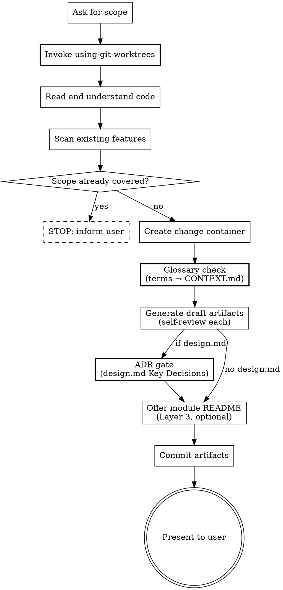

Distill — reverse-engineer Gherkin feature files from existing code.

Use this to bring existing codebases into the Beat workflow. The output is draft `.feature` files that describe **current behavior** (not aspirational), verified independently by `/beat:verify`.

<decision_boundary>

**Use for:**
- Extracting BDD specs from an existing codebase that doesn't have feature files yet
- Bringing a module, directory, or functionality into the Beat workflow retroactively
- Generating draft `.feature` files that describe what the code currently does

**NOT for:**
- Designing new behavior or features (use `/beat:design`)
- Writing aspirational specs for code that doesn't exist yet (use `/beat:design`)
- Greenfield projects with no existing code to distill
- Exploring ideas or thinking through a problem (use `/beat:explore`)

**Trigger examples:**
- "Distill the auth module into feature files" / "Extract specs from existing code" / "Bring this codebase into Beat"
- Should NOT trigger: "design a new feature" / "write specs for something we want to build" / "explore this idea"

</decision_boundary>

<HARD-GATE>
Before writing any artifact files: you MUST invoke superpowers:using-git-worktrees.
Distilled artifacts live in a change container that flows through verify → archive.
Worktree isolation ensures they don't contaminate the main workspace.

Before writing feature files: you MUST run the glossary check (see step 6) and ensure
every project-specific term used in scenarios is defined in `beat/CONTEXT.md`.
Create the glossary lazily — only when the first term is added.

After writing each artifact: you MUST run the four-check spec self-review
(placeholder / consistency / scope / ambiguity). Fix issues inline.

While writing `design.md`: you MUST run the three-condition ADR gate
(hard-to-reverse + surprising + real trade-off — see `references/adr-format.md`)
on each Key Decision recovered from the code. When all three hold, offer to lift
it into `docs/adr/`. The user may decline. NEVER invent rationale the code
doesn't show — mark it unverified or ask the user.

If a prerequisite skill is unavailable (not installed), continue with fallback — but NEVER skip
because you judged it unnecessary.
</HARD-GATE>

**Prerequisites** (invoke before proceeding)

| Superpower | When | Priority |
|-----------|------|----------|
| using-git-worktrees | Before first file write | MUST |

If a superpower is unavailable (skill not installed), skip and continue.

## Rationalization Prevention

| Thought | Reality |
|---------|---------|
| "I don't need a worktree for just writing feature files" | Distilled artifacts flow into plan/apply/archive. Without isolation, they won't carry forward correctly. |
| "The code is simple, I can verify the scenarios myself" | Self-verification of distilled specs is explicitly forbidden. Always use `/beat:verify` for independent accuracy checking. |
| "I'll skip scanning existing features, this is a new area" | Existing features may already cover this behavior. Distilling duplicates creates maintenance burden. |
| "These scenarios are obviously correct, verification is overkill" | Distill extracts specs from code — the most likely error is describing aspirational behavior instead of current behavior. Verification catches this. |
| "I'll commit later, let me just generate the files first" | Uncommitted artifacts can be lost. Commit before presenting to the user, matching design's behavior. |
| "The terms are already in the code, no need for a glossary" | Code shows usage, not meaning. Distill is the moment an established codebase gets its glossary — entries are two lines, add them inline. |
| "I can't know why this decision was made, so no ADR" | You can't invent the why, but you can record the what and ask. Run the gate; mark unverified rationale as unverified instead of skipping. |
| "Spec self-review is overkill, the scenarios came straight from code" | Reading code ≠ describing it accurately. The four checks catch placeholders, contradictions, and ambiguities in 30 seconds. |

## Red Flags — STOP if you catch yourself:

- Writing any file before invoking using-git-worktrees
- Writing scenarios that describe desired behavior instead of current behavior
- Skipping the existing feature scan
- Claiming verification passed without running `/beat:verify`
- Finishing without committing artifacts
- Writing Gherkin scenarios that contain internal method names, numeric thresholds, or implementation constants
- Writing scenarios that use project-specific domain terms not defined in `beat/CONTEXT.md`
- Writing a Key Decision in `design.md` without running the three-condition ADR gate
- Inventing rationale for a recovered decision instead of marking it unverified or asking
- Telling the user to run `/beat:plan` or `/beat:apply` on the distill change itself (there is nothing to implement)
- Thinking "I know the code well enough to skip verification"

## Process Flow


```dot
digraph distill {
    "Ask for scope" [shape=box];
    "Invoke using-git-worktrees" [shape=box, style=bold];
    "Read and understand code" [shape=box];
    "Scan existing features" [shape=box];
    "Scope already covered?" [shape=diamond];
    "STOP: inform user" [shape=box, style=dashed];
    "Create change container" [shape=box];
    "Glossary check\n(terms → CONTEXT.md)" [shape=box, style=bold];
    "Generate draft artifacts\n(self-review each)" [shape=box];
    "ADR gate\n(design.md Key Decisions)" [shape=box, style=bold];
    "Offer module README\n(Layer 3, optional)" [shape=box];
    "Commit artifacts" [shape=box];
    "Present to user" [shape=doublecircle];

    "Ask for scope" -> "Invoke using-git-worktrees";
    "Invoke using-git-worktrees" -> "Read and understand code";
    "Read and understand code" -> "Scan existing features";
    "Scan existing features" -> "Scope already covered?";
    "Scope already covered?" -> "STOP: inform user" [label="yes"];
    "Scope already covered?" -> "Create change container" [label="no"];
    "Create change container" -> "Glossary check\n(terms → CONTEXT.md)";
    "Glossary check\n(terms → CONTEXT.md)" -> "Generate draft artifacts\n(self-review each)";
    "Generate draft artifacts\n(self-review each)" -> "ADR gate\n(design.md Key Decisions)" [label="if design.md"];
    "Generate draft artifacts\n(self-review each)" -> "Offer module README\n(Layer 3, optional)" [label="no design.md"];
    "ADR gate\n(design.md Key Decisions)" -> "Offer module README\n(Layer 3, optional)";
    "Offer module README\n(Layer 3, optional)" -> "Commit artifacts";
    "Commit artifacts" -> "Present to user";
}
```

**Input**: User specifies the code scope to distill (module, directory, or functionality).

**Steps**

1. **Ask for scope**

   If not specified, use **AskUserQuestion tool**:
   > "What code do you want to distill into BDD specs? Specify a module, directory, or describe the functionality."

2. **Ensure worktree isolation**

   Invoke `using-git-worktrees` before reading or writing any files.

3. **Read and understand the code**

   Read the specified code. Map out:
   - User-visible behaviors (functionality)
   - Edge cases handled
   - Error conditions
   - Existing tests (if any) that reveal behavior

4. **Scan existing features**

   Scan `beat/features/**/*.feature` and `beat/changes/*/features/*.feature` (excluding archive):
   - Read `Feature:` and `Scenario:` lines to map existing coverage
   - Deep-read only features that overlap with the distill scope
   - Note which behaviors are already covered — do NOT distill duplicates
   - If the scope is entirely covered: inform user and STOP

5. **Create a change container**

   Create `beat/changes/distill-<scope-name>/` with `status.yaml` (schema: `references/status-schema.md`):
   ```yaml
   name: distill-<scope-name>
   created: YYYY-MM-DD
   phase: new
   source: distill
   pipeline:
     proposal: { status: pending }
     gherkin: { status: pending }
     design: { status: pending }
     tasks: { status: skipped }
   ```

   `tasks` is `skipped` because a distill change describes current behavior — there is
   nothing to implement. Future changes to this area get their own change containers
   via the normal `/beat:design` → `/beat:plan` → `/beat:apply` flow.

6. **Generate draft artifacts**

   Read `beat/config.yaml` if it exists (schema: `references/config-schema.md`). Use `language` for artifact output language, inject `context` as project background, and apply matching `rules` per artifact type (e.g., `rules.gherkin`, `rules.proposal`, `rules.design`).

   **Glossary check (Layer 1) — before writing feature files:**

   Read `beat/CONTEXT.md` if it exists (schema: `references/context-format.md`). Create it lazily when the first term is added — never preemptively.

   Distill is often the first time an established codebase builds its glossary, and the code itself is the source. For each project-specific term that will appear in scenarios, adapt the four challenges from `references/context-format.md` and update `beat/CONTEXT.md` **inline** as terms resolve (never batch):

   1. **Against the glossary** — the term conflicts with an existing entry? Surface, resolve, update.
   2. **Sharpen fuzzy** — the code uses synonyms for one concept (e.g. `user`/`account`/`member` for the same entity)? Pick the canonical word, list the others as `_Avoid_`.
   3. **Stress-test against code** — probe term boundaries with the edge cases the code actually handles; name the boundary.
   4. **Cross-reference docs** — README/comments/docs use a term differently from the code? Surface it and ask the user which is canonical.

   Every project-specific term used in scenarios MUST exist in `beat/CONTEXT.md` before the scenario is written. Bold terms in scenarios are the canonical form (see `references/feature-writing.md`). If a term's meaning is genuinely uncertain from code alone, ask the user rather than guessing.

   **features/*.feature (mandatory):**
   - Read `references/feature-writing.md` for conventions on description blocks, scenario organization, and review checklist
   - Write feature files describing CURRENT behavior (not desired behavior)
   - Each scenario must accurately reflect what the code actually does
   - Use tags: `@distilled` (always), plus `@happy-path`, `@error-handling`, `@edge-case`
   - Every scenario MUST have a testing layer tag (`@e2e` or `@behavior`, default `@behavior`)
   - If behavior is ambiguous, note it as uncertain rather than guessing

   **proposal.md (optional):**
   - If the purpose is clear from code/docs: write a brief "why this exists" proposal
   - Sections: `## Why`, `## What Changes`, `## Impact`

   **design.md (optional):**
   - Document the current technical architecture and key decisions visible in the code
   - Sections: `## Approach`, `## Key Decisions`, `## Components`
   - **ADR gate** — for each Key Decision recovered from the code, run the three-condition check from `references/adr-format.md`:
     1. Hard to reverse?
     2. Surprising without context?
     3. Result of a real trade-off?
     Recovered decisions are prime candidates — "surprising without context" is exactly what code archaeology surfaces. **Caveat**: the code shows *what* was decided, not *why*. Take rationale from evidence (commit history, comments, docs) or from the user; if neither is available, record the decision with rationale marked unverified (e.g. "Rationale unconfirmed — recovered from code"). Never invent a why.
     If **all three** hold, use **AskUserQuestion tool**: *"This recovered decision meets the ADR gate. Lift it into `docs/adr/`?"* On Yes, write a 1-3 sentence ADR per the template in `references/adr-format.md`, incrementing the highest existing number. On No, continue. Create `docs/adr/` lazily — only on first ADR.

   **Spec self-review (after writing each artifact):**

   Re-read the artifact with fresh eyes and check:

   1. **Placeholder scan** — any `TBD`, `TODO`, incomplete sections, vague descriptions?
   2. **Internal consistency** — do sections contradict each other? Do scenarios contradict the proposal/design?
   3. **Scope check** — does the artifact stay within the distill scope, or did it drift into adjacent behavior?
   4. **Ambiguity check** — could any scenario be read two different ways? If so, pick the reading the code supports and make it explicit.

   Fix issues inline. No need to re-review the fix — just fix and move on.

   Update `status.yaml` for each artifact created. Set phase to the latest completed spec artifact.

   **Module README offer (Layer 3, optional):**

   If the distilled scope is a module (its own directory with a public interface) and it has no `README.md`, offer once to scaffold one per `references/architecture-format.md`. If `beat/ARCHITECTURE.md` exists and is missing this module's row, offer to add it. Advisory — the user may decline; never block.

7. **Commit artifacts**

   Commit all change artifacts: `git add beat/changes/distill-<scope-name>/ && git commit`

   Use a descriptive message: "distill(<scope>): extract BDD specs from existing code"

8. **Present to user for review**

   Show:
   - All generated feature files (summary of scenarios per feature)
   - Any remaining uncertainties about behavior
   - Existing features that overlap (from step 4 scan)

   ```
   ## Distill Complete: distill-<scope-name>

   Created:
   - features/*.feature (N scenarios across M files)
   - proposal.md (or skipped)
   - design.md (or skipped)

   Glossary: N terms added to beat/CONTEXT.md (or "no new terms")
   ADRs: N written to docs/adr/ (or "none qualified")

   Uncertainties: [list any ambiguous behaviors]

   Next steps:
   - Review the draft feature files for accuracy
   - Run `/beat:verify` to independently verify scenarios match code behavior (accuracy mode)
   - Run `/beat:archive` to sync verified features into `beat/features/` living documentation
   - Future changes to this area use the normal flow: `/beat:design` → `/beat:plan` → `/beat:apply`
   ```

**Distill vs Normal Flow**

```
Normal:  Spec -> Code   (write spec first, then implement)
Distill: Code -> Spec   (extract spec from existing code)
              |
         /beat:verify confirms accuracy (source: distill → accuracy mode)
              |
         /beat:archive syncs features into living documentation
              |
         Future changes use normal BDD flow (new change container)
```

