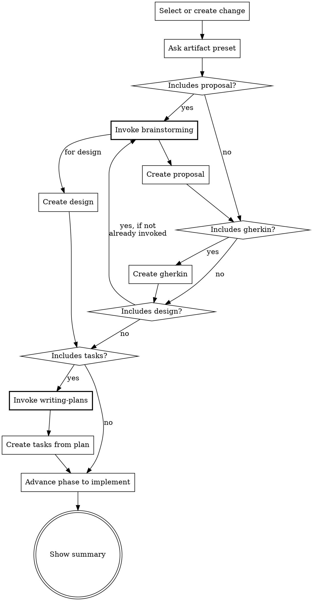

Fast-forward -- create a change (if needed) and generate all artifacts in one go.

<HARD-GATE>
When the artifact selection includes tasks, you MUST invoke superpowers:writing-plans before
generating any task content. Do NOT write tasks inline. writing-plans IS the task creation
process. This applies regardless of change complexity or time pressure.

When the artifact selection includes proposal or design, you MUST invoke superpowers:brainstorming
before generating content. This applies even when scope seems obvious.

If a prerequisite skill is unavailable (not installed), continue with fallback — but NEVER skip
because you judged it unnecessary.
</HARD-GATE>

**Prerequisites** (invoke before proceeding)

| Superpower | When | Priority |
|-----------|------|----------|
| brainstorming | Before creating proposal or design | MUST |
| writing-plans | When creating tasks | MUST |

If a superpower is unavailable (skill not installed), skip and continue.

## Rationalization Prevention

| Thought | Reality |
|---------|---------|
| "ff is meant to be fast, writing-plans will slow it down" | ff is fast-forward through *creation*, not through *quality*. writing-plans IS how tasks get created. |
| "This change is simple enough to write tasks inline" | Simple changes finish writing-plans quickly. Complex changes need it most. There is no middle ground where skipping helps. |
| "I already understand the scope from the proposal/gherkin" | Understanding scope ≠ properly decomposed tasks. writing-plans catches scope gaps you haven't noticed. |
| "The user wants speed, invoking superpowers will slow us down" | Skipping prerequisites produces lower-quality artifacts that cause rework during apply and verify. |
| "brainstorming isn't needed, the user already described what they want" | A description is not a design. brainstorming surfaces assumptions, alternatives, and edge cases. |

## Red Flags — STOP if you catch yourself:

- Writing `- [ ]` task checkboxes without having invoked writing-plans
- Generating proposal sections without having invoked brainstorming
- Thinking "this prerequisite isn't needed for this particular change"
- Skipping a MUST prerequisite and planning to "compensate" later

## Process Flow



## Tasks Gate

When the user's artifact selection includes tasks:

1. You MUST invoke `superpowers:writing-plans` — this is the task creation process
2. Pass the completed artifacts (proposal, gherkin, design) as context to writing-plans
3. The output of writing-plans becomes tasks.md — do NOT generate tasks.md yourself
4. If writing-plans is unavailable (not installed), create tasks.md as fallback with notice:
   `<!-- Generated without writing-plans. Consider re-running with superpowers plugin. -->`

Do NOT:
- Write task checkboxes before invoking writing-plans
- "Summarize" the writing-plans output into simpler tasks
- Skip writing-plans because "the tasks are obvious"

**Input**: Change name (kebab-case) OR a description of what to build. Can also be an existing change name to fast-forward remaining artifacts.

**Steps**

1. **If no clear input provided, ask what they want to build**

   Use **AskUserQuestion tool** to ask what they want to build.
   Derive kebab-case name from description.

2. **Create or select change**

   - If `beat/changes/<name>/` doesn't exist: create it (same as beat:new: directory + status.yaml + features/.gitkeep)
   - If it exists: use it, read `status.yaml` (schema: `references/status-schema.md`) to find remaining artifacts

3. **Ask which optional artifacts to include**

   Read `status.yaml`. For artifacts still `pending`, ask user once upfront:

   Use **AskUserQuestion tool**:
   > "Which optional artifacts do you want?"
   > 1. Full: Proposal + Gherkin + Design + Tasks (recommended for large features)
   > 2. Standard: Proposal + Gherkin (recommended for medium features)
   > 3. Minimal: Gherkin only (recommended for small bug fixes)
   > 4. Technical: Proposal + Tasks, no Gherkin (for tooling/infra/refactor changes with no behavior change)
   > 5. Custom: Let me choose each one

   Mark skipped artifacts as `skipped` in `status.yaml`.

4. **Create artifacts in pipeline order**

   Read `beat/config.yaml` if it exists (schema: `references/config-schema.md`). Use `language` for artifact output language, inject `context`, and apply matching `rules` per artifact type throughout creation.

   For each artifact to create (pipeline order: proposal -> gherkin -> design -> tasks):
   - Read all completed artifacts for context
   - Invoke prerequisites per the table above (brainstorming before proposal/design, writing-plans for tasks)
   - Create the artifact following the patterns below
   - Update `status.yaml`
   - Show brief progress: "Created <artifact>"
   - If context is critically unclear, pause and ask

   **Artifact patterns:**
   - **Proposal**: Sections: `## Why`, `## What Changes`, `## Impact`
   - **Gherkin**: SpecFlow style, tags `@happy-path`/`@error-handling`/`@edge-case`, Feature description carries PRD essence. Every scenario MUST have a testing layer tag (`@e2e` for user journeys needing a running app, or `@behavior` for business logic testable without a full app; default `@behavior`). Write scenarios at behavior level — describe what the system does ("Monthly billing adjusts for short months"), not how a function works ("calculateNextTransactionDate clamps to last day"). If option 4 (Technical) was chosen, skip gherkin entirely.
   - **Design**: Sections: `## Approach`, `## Key Decisions`, `## Components`
   - **Tasks**: See Tasks Gate above. writing-plans output is adapted: use `- [ ]` checkboxes, `### Task N:` headings, save to `tasks.md` (not `docs/plans/`), skip execution handoff. If writing-plans unavailable, use fallback checklist with notice comment.

5. **Show final status**

   Update phase to `implement` in `status.yaml`.

   ```
   ## Fast-Forward Complete: <change-name>

   Created:
   - proposal.md (or skipped)
   - features/*.feature (or skipped if Technical option)
   - design.md (or skipped)
   - tasks.md (or skipped)

   All artifacts ready! Run `/beat:apply` to start implementation.
   ```

**Guardrails**
- Gherkin is mandatory by default -- only skip for purely technical changes (option 4: Technical)
- Ask upfront which optional artifacts to include (don't ask per artifact)
- If change already exists with some artifacts done, only create remaining
- If context is critically unclear, ask -- but prefer reasonable defaults to keep momentum
- Verify each artifact file exists after writing before proceeding
