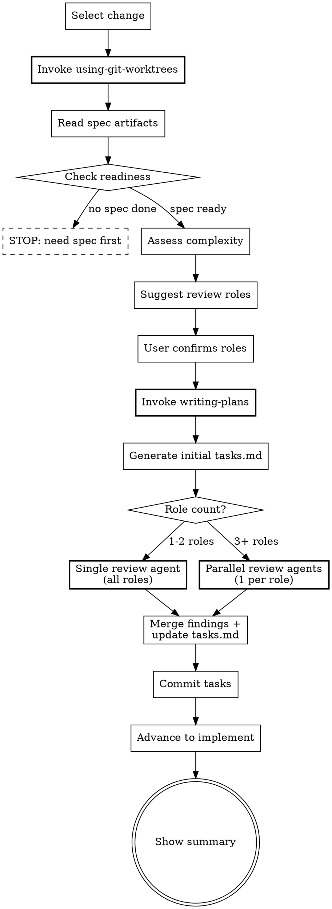

Plan the execution — read spec artifacts, review from multiple perspectives, then generate tasks.md.

<decision_boundary>

**Use for:**
- Breaking down spec artifacts into implementation tasks (tasks.md)
- Multi-role review of an execution plan before implementation
- Re-generating or updating tasks for an existing change

**NOT for:**
- Creating spec artifacts like proposal, gherkin, or design.md (use `/beat:design`)
- Exploring ideas or investigating a problem (use `/beat:explore`)
- Implementing code (use `/beat:apply`)
- Verifying implementation (use `/beat:verify`)

**Trigger examples:**
- "Break down the tasks" / "Create execution plan" / "Plan the implementation" / "Review and generate tasks"
- Should NOT trigger: "design a new feature" / "write gherkin for X" / "implement the change"

</decision_boundary>

<HARD-GATE>
Before writing any files: you MUST invoke superpowers:using-git-worktrees.
You MUST invoke superpowers:writing-plans to generate tasks. Do NOT write tasks inline.
writing-plans IS the task creation process. This applies regardless of change complexity or time pressure.

You MUST have at least one spec artifact done (gherkin or proposal) before proceeding.
Do NOT create tasks from a description alone — spec artifacts are the input.

If a prerequisite skill is unavailable (not installed), continue with fallback — but NEVER skip
because you judged it unnecessary.
</HARD-GATE>

**Prerequisites** (invoke before proceeding)

| Superpower | When | Priority |
|-----------|------|----------|
| using-git-worktrees | Before first file write | MUST |
| writing-plans | When creating tasks | MUST |

If a superpower is unavailable (skill not installed), skip and continue.

## Rationalization Prevention

| Thought | Reality |
|---------|---------|
| "I don't need a worktree, design already committed the artifacts" | Design may not have run, or the worktree may not exist yet. using-git-worktrees is idempotent — if already isolated, it detects and continues. |
| "This change is simple enough to write tasks inline" | Simple changes finish writing-plans quickly. Complex changes need it most. There is no middle ground where skipping helps. |
| "I already understand the scope from the proposal/gherkin" | Understanding scope ≠ properly decomposed tasks. writing-plans catches scope gaps you haven't noticed. |
| "The user wants speed, invoking superpowers will slow us down" | Skipping prerequisites produces lower-quality tasks that cause rework during apply. |
| "The spec artifacts are clear enough, review is overkill" | Review catches blind spots that the spec author can't see. The more obvious the spec seems, the more likely assumptions are hiding. |
| "I'll skip review for this small change" | Small changes still benefit from a test coverage check. Review scales with complexity — it's fast for simple changes. |

## Red Flags — STOP if you catch yourself:

- Writing any file before invoking using-git-worktrees
- Writing `- [ ]` task checkboxes without having invoked writing-plans
- Creating tasks without reading spec artifacts first
- Thinking "review isn't needed for this particular change"
- Skipping a MUST prerequisite and planning to "compensate" later
- Proceeding without at least one spec artifact (gherkin or proposal) being done

## Process Flow



**Input**: Optionally specify a change name. If omitted, infer from context or prompt.

**Steps**

1. **Select the change**

   If no name provided:
   - Look for `beat/changes/` directories (excluding `archive/`)
   - If only one exists, use it (announce: "Using change: <name>")
   - If multiple exist, use **AskUserQuestion tool** to let user select

2. **Ensure worktree isolation**

   Invoke `using-git-worktrees` before reading or writing any files. If already in a worktree (e.g., from design), it detects and continues.

3. **Read spec artifacts and verify readiness**

   Read `status.yaml` (schema: `references/status-schema.md`).

   Check that either:
   - `gherkin` has `status: done` → **Gherkin-driven**
   - `gherkin` has `status: skipped` AND `proposal` has `status: done` → **Proposal-driven**

   If neither condition is met: "Spec artifacts are required before task breakdown. Run `/beat:design` first." STOP.

   If `tasks` already has `status: done`: "Tasks already exist. Re-running will regenerate tasks.md." Confirm with user before proceeding.

   Read all available artifacts:
   - `proposal.md` (if exists)
   - `features/*.feature` (all files, if gherkin is done)
   - `design.md` (if exists)

   Read `beat/config.yaml` if it exists (schema: `references/config-schema.md`). Use `language` for output language, inject `context`, and apply `rules.tasks` as additional constraints.

4. **Assess change complexity and suggest review roles**

   Evaluate complexity based on:
   - Number of feature files and scenarios
   - Number of components/services mentioned in design.md
   - Whether `@e2e` scenarios exist (implies integration surface)
   - Whether design.md mentions external dependencies, DB changes, or API changes

   **Suggest review roles based on complexity:**

   Use **AskUserQuestion tool**:
   > "Based on the spec artifacts, I suggest the following review perspectives:
   > [dynamically selected roles with rationale]
   >
   > Adjust, add, remove, or confirm?"

   **Role selection guidance:**

   | Signal | Suggested role |
   |--------|---------------|
   | Always included | **Test coverage**: Are all scenarios covered? Any gaps? |
   | `@e2e` scenarios present | **Integration**: Are integration boundaries identified? |
   | design.md mentions API/DB changes | **Architecture**: Is the design consistent with existing patterns? |
   | proposal.md mentions user-facing changes | **User experience**: Does the plan match user expectations? |
   | design.md mentions auth/data/external APIs | **Security**: Are there security considerations? |
   | High scenario count (>5) or multiple features | **Scope**: Is the decomposition granular enough? |

   Test coverage is always included. Other roles are suggested dynamically.
   The user can add custom roles (e.g., "performance", "accessibility") or remove suggested ones.

5. **Generate initial tasks via writing-plans**

   Invoke `superpowers:writing-plans`. Pass the completed artifacts (proposal, gherkin, design) as context.

   The output of writing-plans becomes the initial tasks.md — do NOT generate tasks.md yourself.

   If writing-plans is unavailable (not installed), create tasks.md as fallback with notice:
   `<!-- Generated without writing-plans. Consider re-running with superpowers plugin. -->`

   **Task Decomposition Principles** — if writing-plans output violates any principle, decompose further before saving tasks.md:

   - **Single concern**: one component, service, or API endpoint per task. "Build X and integrate into Y" = two tasks.
   - **~200 LOC cap**: each task produces ~200 lines of new code (excluding tests). More = too many responsibilities.
   - **2-3 files max**: each task touches at most 2-3 source files. More = crossing concern boundaries.
   - **Independently verifiable**: can run tests after completing without depending on later tasks.
   - **"And then" test**: if a task description needs "and then", split it.
   - Exception: project initialization/scaffolding tasks may exceed file limits while maintaining single concern.

   **Quality Principles header** — insert the following block between the tasks.md header and the first `### Task`:

   ```
   ## Quality Principles

   **Testing:** Tests verify behavior (return values, state changes, responses), not wiring.
   If the main assertion is `toHaveBeenCalledWith`, rewrite to assert on the function's output.

   **Code:** No single new file exceeds ~300 lines. If it grows past that, split into focused sub-modules.
   ```

   Save the initial tasks.md to `beat/changes/<name>/tasks.md`.

6. **Dispatch review agents**

   Read `review-subagent-prompt.md` for the subagent prompt template.

   **Dispatch strategy based on confirmed role count:**

   - **1–2 roles**: Single **Agent** (subagent_type: `Explore`) with all confirmed roles. Build one prompt containing all roles and their focus areas.
   - **3+ roles**: One **Agent** (subagent_type: `Explore`) **per role**, dispatched in parallel. Each agent receives ONLY its own role and focus area — no knowledge of other roles.

   Every agent receives:
   - All spec artifacts (proposal, gherkin, design)
   - The initial tasks.md

   Do NOT pass conversation history or session context to any agent.

   **Why parallel at 3+**: A single agent reviewing from many perspectives simultaneously loses depth and independence — findings from one role bias another. Independent agents give genuine blind-spot coverage. At 1–2 roles the overhead isn't worth the split.

   **Fallback**: If any agent fails or returns empty, proceed with findings from the others. If ALL fail, use initial tasks.md as-is. Show notice: "Review could not be completed — tasks.md was not reviewed. Consider re-running `/beat:plan`."

7. **Merge findings and update tasks.md**

   Collect findings from all review agents. If parallel agents were used:
   - Deduplicate findings that identify the same issue from different roles
   - When findings conflict, prefer the more conservative recommendation

   Read `beat/changes/<name>/tasks.md`, then use the **Edit tool** to apply:
   - Add missing tasks or steps identified by the review
   - Split tasks that the review flagged as too broad
   - Add test coverage notes where the review found gaps
   - Reorder tasks if the review identified dependency issues

   Show the user a brief summary of what changed:
   ```
   ## Review Applied

   - [Role]: <what was changed>
   - [Role]: <what was changed>
   ...
   ```

   Update `status.yaml`: set `tasks` to `{ status: done }` and phase to `tasks`.

8. **Commit and advance phase**

   Commit tasks.md and updated status.yaml: `git add beat/changes/<name>/ && git commit`

   Update phase to `implement` in `status.yaml` (advancing from `tasks` → `implement`).

   ```
   ## Plan Complete: <change-name>

   Tasks: N tasks in tasks.md
   Review: [list of roles that reviewed]
   Changes from review: [count of modifications]

   Ready for implementation! Run `/beat:apply` to start.
   ```

**Guardrails**
- NEVER proceed without at least one spec artifact (gherkin or proposal) being done
- NEVER write tasks inline — always use writing-plans (or fallback with notice)
- Review is part of the process, not optional — but depth scales with complexity
- Test coverage review is always included regardless of complexity
- Apply review findings directly to tasks.md, not as a separate report
- If review reveals spec-level issues (missing scenarios, design gaps), surface them to the user rather than silently compensating in tasks
