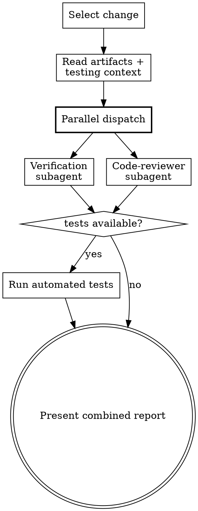

Verify implementation against change artifacts using four dimensions. Uses independent subagents to eliminate context bias.

<HARD-GATE>
You MUST dispatch independent subagents for verification — NEVER verify implementation yourself
in the main session. The main session has context bias from the conversation history.

Dispatch the verification subagent AND code-reviewer in parallel — they are independent checks.

If a subagent fails, proceed with findings from the other. If BOTH fail, report the failure —
do NOT fall back to self-verification.
</HARD-GATE>

## Rationalization Prevention

| Thought | Reality |
|---------|---------|
| "The change is small, I can verify it myself" | Self-verification creates confirmation bias. You saw the implementation — you can't objectively verify it. |
| "I already reviewed the code during apply" | That's exactly why you need an independent verifier. Familiarity breeds blind spots. |
| "Running two subagents is overkill for this" | Code quality and spec alignment are independent dimensions. A single agent conflates them. |
| "I'll just run the tests, that's verification enough" | Tests verify behavior but not spec alignment, design adherence, or code quality. |
| "I'll dispatch them sequentially to save context" | They're independent — parallel dispatch is faster and prevents one report from biasing the other. |

## Red Flags — STOP if you catch yourself:

- Verifying any dimension yourself instead of dispatching a subagent
- Dispatching subagents sequentially instead of in parallel
- Skipping code-reviewer because "the code is simple"
- Claiming verification passed without reading the subagent reports
- Editing code during verification (verify reads, doesn't write)
- Falling back to self-verification because a subagent failed

## Process Flow

**Input**: Optionally specify a change name. If omitted, infer from context or prompt.

**Steps**

1. **Select the change**

   If no name provided:
   - Look for `beat/changes/` directories (excluding `archive/`)
   - If only one exists, use it
   - If multiple exist, use **AskUserQuestion tool** to let user select

2. **Read all artifacts and determine testing context**

   Read from `beat/changes/<name>/`:
   - `status.yaml` (schema: `references/status-schema.md`)
   - `features/*.feature` (all Gherkin files, if gherkin status is `done`)
   - `proposal.md` (if exists)
   - `design.md` (if exists)
   - `tasks.md` (if exists)

   Read `beat/config.yaml` (if exists, schema: `references/config-schema.md`).

   **Determine drive mode:**
   - If `gherkin` status is `done` → **Gherkin-driven verification**
   - If `gherkin` status is `skipped` → **Proposal-driven verification**

   **Determine testing context** (three-layer priority: tag > source > config):
   - **Config layer**: Is `testing.required` set to `false`? If yes, skip test existence checks globally.
   - **Source layer**: Does `status.yaml` contain `source: distill`? If yes, Dimension 1 switches to **accuracy mode** (see below).
   - **Tag layer**: Every scenario in a .feature file is expected to have a corresponding test (in TDD mode).

3. **Dispatch verification subagent AND code-reviewer in parallel**

   Launch BOTH agents simultaneously using a single message with two Agent tool calls:

   **Agent A — Verification subagent** (subagent_type: `Explore`):
   Read `verification-subagent-prompt.md` for the complete subagent prompt.

   Provide ONLY:
   - All artifact contents (features, proposal, design, tasks)
   - Testing context (drive mode, testing config, source flag, tag counts)
   - Do NOT pass conversation history or session context.

   **Agent B — Code quality review** (subagent_type: `superpowers:code-reviewer`):

   Provide:
   - The change name and description (from proposal or status.yaml)
   - List of files created/modified during apply
   - The planning document (tasks.md or proposal.md) as the "original plan"

   This reviews: code quality, architecture, naming, error handling, test quality, security, and plan alignment.

   **Fallback**: If one agent fails, proceed with the other's findings. If BOTH fail, report failure — do NOT self-verify.

4. **Run automated tests if available**

   Detect and run the project's test suite:
   - **Behavior tests**: run using `testing.behavior` framework (or auto-detect)
   - **E2E tests**: run using `testing.e2e` framework (or auto-detect). If `gherkin.modified` exists in status.yaml, combine BDD feature paths: `beat/features/` + `beat/changes/<name>/features/`
   - Report behavior and e2e results separately

5. **Present combined verification report**

   Combine both subagent reports:
   - Dimensions 1-3 from verification subagent (spec alignment)
   - Dimension 4 from code-reviewer (code quality)
   - Step 4 test results (if available)

**Issue Classification**
- CRITICAL: Must fix (missing scenario test [in coverage mode], inaccurate scenario [in accuracy mode], unimplemented goal, design violation, security vulnerability)
- WARNING: Should fix (partial coverage, possible divergence, non-executable test, Gherkin quality issues, code quality concerns)
- SUGGESTION: Nice to fix (pattern inconsistency, minor improvement, missing test in distill mode)

**Graceful Degradation**
- Gherkin skipped: skip Dimension 1, strengthen Dimension 2 (proposal alignment)
- Only features exist: verify Gherkin coverage only
- Features + proposal: verify coverage + alignment
- Features + proposal + design: verify all four dimensions
- Always note which checks were skipped and why
